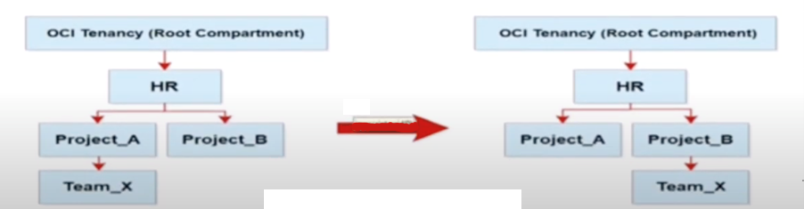
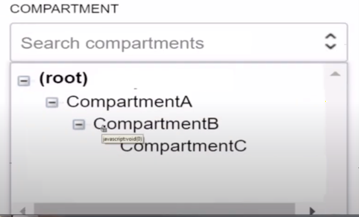
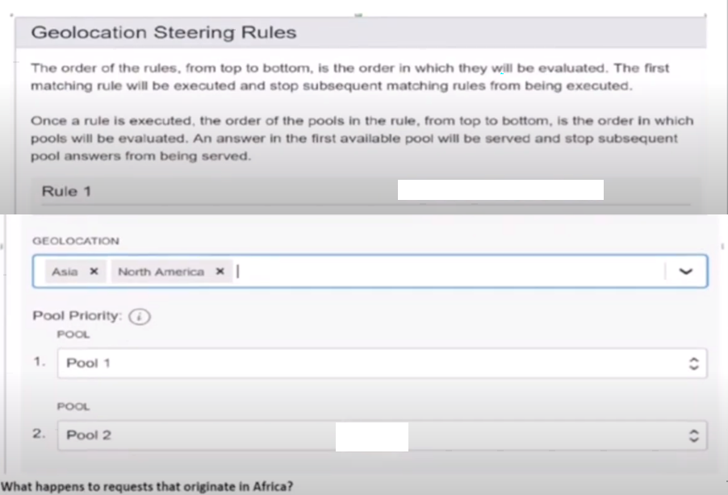
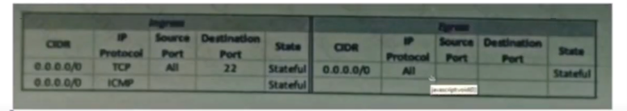
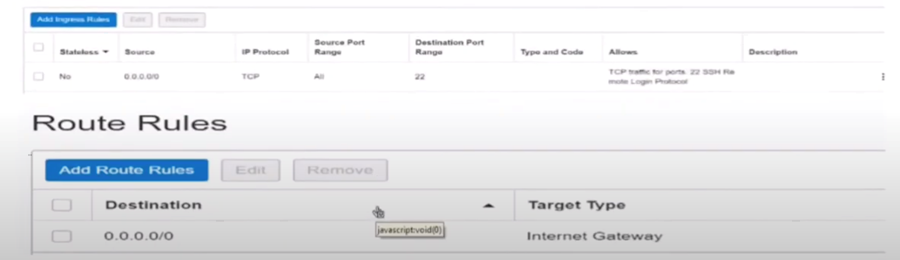

## Terraform and OCI Resource Manager
- You run Terraform in your laptop.  After you provision an instance, you want to capture the IP address of the provisioned instance and save to a local file.
Which Terraform feature that you will use to accomplish the task?
	- [ ] Remote-exec provisioner
	- [x] Local-exec provisioner

- You have recently been asked to take over management of your company's infrastructure provisioning efforts, utilizing Terraform v0.12 to provision and manage infrastructure resources in Oracle Cloud Infrastructure (OCI). For the past few days the development environments have been failing to provision. Terraform returns the following error:
	```
	Error: Missing item separator 
		on vcn_peer_lab.tf line 15, in resource "oci_core_security_list" "ManagementSecurityList": 15 tcp_options = (min = "22", max = "22")
	Expected a comma to mark the beginning of the next item.
	```
	You locate the related code block in the Terraform config and find the following:
	(11)	ingress_security_rules {
	(12)	protocol = 6
	(13)	source = "0.0.0.0/0"
	(14)
	(15)	tcp_options = [min = "22", max = "22"]
	(16)	}
	Which correction should you make to solve this issue?
	- [ ] Replace the curly braces '{}' in lines 11 and 16 with square braces '[]'
	- [x] Modify line 15 to be the following: `tcp_options {min="22", max="22"}`
	- [ ] Modify line 15 to be the following: `tcp_options = {min="22", max="22"}`
	- [ ] Place a command at the end of line 16
- You are a cloud operations administrator who has recently joined a new department. You have created 10 Terraform stacks using Oracle Cloud Infrastructure (OCI) resource manager. Each stack creates a different set of resources in OCI for your development team. 

	What determines the cost of these Terraform stacks?
	- [ ] The cost for each stack will be higher for pay as you go (PAYG) than for monthly flex billing.
	- [ ] The length of time it takes to build each resource using these Terraform stacks
	- [x] Resource manager stacks are free but you are charged for the resources they create.
- You have created an Autonomous Data Warehouse (ADW) service in your company's Oracle Cloud Infrastructure (OCI) tenancy and you now have to load historical data into it. You have already extracted this historical data from multiple data marts and data warehouses. This data is stored in CSV text files these file are ranging in size from 25 MB to 20 GB.

	Which step is most efficient and error tolerant method for loading data into ADW?
	- [ ] Create Auth token, use it to create an object storage credential by executing DBMS_CLOUD.CREATE_CREDENTIAL, using OCI CLI upload the CSV files to an OCI object storage bucket, create the tables in the ADW database and then execute Data Pump Import for each CSV file to copy the contents into the corresponding ADW database table.
	- [ ] Create Auth token, use it to create an object storage credential by executing DBMS_CLOUD.CREATE_CREDENTIAL, using the web console upload the CSV files to an OCI object storage bucket, create the tables in the ADW database and then execute DBMS_CLOUD.COPY_DATA for each CSV file to copy the contents into the corresponding ADW database table.
	- [x] Create Auth token, use it to create an object storage credential by executing DBMS_CLOUD.CREATE_CREDENTIAL, using OCI CLI upload the CSV files to an OCI object storage bucket, create the tables in the ADW database and then execute DBMS_CLOUD.COPY_DATA for each CSV file to copy the contents into the corresponding ADW database table.
	- [ ] Create the tables in the ADW database and then execute SQL* Loader for each CSV file to load the contents into the corresponding ADW database table.

- You are helping a customer to use Oracle Cloud Infrastructure Resource Manager to automate their infrastructure. Which of the below options is FALSE regarding Resource Manager?
	- [ ] Resource Manager consists of Terraform configuration files and each file are in HCL or JSON format.
	- [ ] To control access to the Terraform state file, you can create a security policy that limits access to reading jobs. 
	- [x] With Resource Manager, you cannot execute scripts or commands on a remote computer.
	- [ ] For a given Resource Manager stack, only one job can be run at a time. 

- Your company recently adopted a hybrid cloud architecture which requires them to migrate some of their on-premises web applications to Oracle Cloud Infrastructure (OCI). You created a Terraform template which automatically provisions OCI resources such as compute instances. load balancer and a database instance.
	After running the stack using the terraform apply command, it successfully launched the compute instances and the load balancer, but it failed to create a new database instance with the following error:
	`Service error: NotAuthorizedOrNotFound. shape VM.Standard2.4 not found, http status code: 404`
	You discovered that the resource quotas assigned to your compartment prevent you from using VM.Standard2.4 instance shapes available in your tenancy. You edit the Terraform script and replace the shape with VM.Standard 2.2
	Which options would you recommend to re-run the terraform command to have required OCI resources provisioned with the least effort?
	- [ ] `terraform apply -target=oci_database_db_system.db_system`
	- [x] `terraform apply -auto-approve`
	- [ ] `terraform plan -target=oci_database_db_system.db_system`
	- [ ] `terraform refresh -target=oci_database_db_system.db_system`

- What is a key benefit of using Oracle Cloud Infrastructure's Resource Manger for your Terraform provisioning and management activities?
	- [ ] You can use Resource Manager to identify and maintain and Inventory of all Compute and Database instances across your tenancy.
	- [x] Resource Manager manages the Terraform state file for your infrastructure and locks the file so that only one job at a time can run on a given stack. 
	- [ ] Resource Manager has administrate privileges by design. Even if your IAM user does not have access, you can leverage Resource Manager provision new resources to any compartment in the Tenancy.
	- [ ] You can use Resource Manager to apply patches to all existing Oracle Linux instances in a specified compartment.

## Compartment and IAM
- How can you provide user access to an existing compartment in Oracle Cloud Infrastructure?
	- [ ] by granting users access to the compartment when the compartment is created
	- [ ] by adding users to a compartment; all users in the compartment will have access to the resources in the compartment
	- [ ] by granting access directly to the user when the user is created
	- [x] by adding user to a group and defining policy to provide the group access to the compartment
- Your company has restructured its HR departments. As part of this change, you also need to re-organize compartments within Oracle Cloud Infrastructure (OCI) to align them to the company's new organizational structure. The following change is required. 

	Compartment Team_X needs to be moved under a new parent compartment. Project_B
	
	The tenancy has the following policies defined for compartments Project_A and Project_B:
	`Allow group G1 to manage instance-family in compartment HR:Project_A`
	`Allow group G2 to manage instance-family in compartment HR:Project_B`
	Which two statements describe the impacts after the compartment Team_X is moved?
	- [ ] Group G2 can now manage instance-families in compartment Project_A but not in compartment Team_X
	- [x] Group G1 can now manage instance-families in compartment Project_A but not in compartment Team_X
	- [ ] Group G1 can now manage instance-families in compartment project_A, compartment project_B and compartment Team_X
	- [x] Group G2 can now manage instance-families in compartment Project_B and compartment Team_X
	- [ ] Group G2 can now manage instance-families in compartment Project_B, compartment Project_A and compartment Team_X
- You deployment platform within Oracle Cloud Infrastructure (OCI) leverages a compute instance with multiple block volumes attached. There are multiple teams that use the same compute instance and have access to these block volumes. You want to ensure that no one accidentally deletes of these block volumes. You have started to construct the following IAM policy but need to determine which permissions should be used.

	```
	allow group DeploymentUsers to manage volume-family where ANY {
		request.permission != <???>,
		request.permission != <???>,
		request.permission != <???>
	}
	```
	- [ ] VOLUME_ERASE, VOLUME_ATTACHMENT_ERASE, VOLUME_BACKUP_ERASE
	- [ ] ERASE_VOLUME, ERASE_VOLUME_ATTACHMENT, ERASE_VOLUME_BACKUP
	- [ ] DELETE_VOLUME, DELETE_VOLUME_ATTACHMENT, DELETE_VOLUME_BACKUP
	- [x] VOLUME_DELETE, VOLUME_ATTACHMENT_DELETE, VOLUME_BACKUP_DELETE
- You have the following compartment structure within your company's Oracle Cloud Infrastructure (OCI) tenancy:
	
	You want to create a policy in the root compartment to allow SystemAdmins to manage VCNs only in compartmentC. Which policy is correct
	- [ ] Allow group SystemAdmins to manage virtual-network-family in compartment CompartmentC
	- [x] Allow group SystemAdmins to manage virtual-network-family in compartment CompartmentA:CompartmentB:CompartmentC
	- [ ] Allow group SystemAdmins to manage virtual-network-family in compartment CompartmentB:CompartmentC
	- [ ] Allow group SystemAdmins to manage virtual-network-family in compartment root

- You created a group for several auditors. You assign the following policies to the group:
	`Allow group Auditors to inspect all-resources in tenancy`
	`Allow group Auditors to read instances in tenancy`
	`Allow group Auditors to read audit-events in tenancy`
	What actions are the auditors allowed to perform within your tenancy?
	- [ ] Auditors are able to create new instances in the tenancy.
	- [x] Auditors are able to view all resources in the compartment.
	- [ ] The auditors are able to delete resources in the tenancy.
	- [ ] The auditors can view resources in the tenancy.
		- suspicious on not choosing D
## Budget, usage and quota
- You have a group of developers who launch multiple VM.Standard2.2 compute instances every day into the compartment `Dev`. As a result your OCI tenancy quickly hit the service limit for this shape. Other groups can no longer create new instances using VM.Standard2.2 shape. From this, your company has issued a new mandate that the `Dev` compartment must include a quota to allow for use of only 20 VM.standard shapes per availability domain.
	Your solution should not affect any other compartment in the tenancy.
	Which quota statement should be used to implement this new requirement?
	- [ ] 	```
			zero compute quotas in tenancy
			set compute quota vm-standard2-2-count to 20 in tenancy
			```
	- [ ]	```
			zero compute quotas in tenancy
			set compute quota vm-standard2-2-count to 20 in compartment dev
			```
	- [x]	```
			set compute quota vm-standard2-2-count to 20 in compartment dev
			```
	- [ ]	```
			set compute quota vm-standard2-2-count to 20 in compartment dev where request.region=us-phoenix-1
			```
- You as an admin want to provide IAM group `FinanceAuditors` to analyze the spending in the Oracle Cloud Infrastructure tenancy. Which of the below policy statement will you define?
	- [ ] `Allow group FinanceAuditors to read cost-reports in tenancy`
	- [ ] `Allow group FinanceAuditors to read usage-cost in tenancy`
	- [x] `Allow group FinanceAuditors to read usage-reports in tenancy`
	- [ ] `Allow group FinanceAuditors to read spend-reports in tenancy`
- Recently your e-commerce web application has been receiving significantly more traffic than usual. Users are reporting they often encounter a 403, when trying to access your site. Sometimes the site is very slow.

	You check your instance pool configuration to confirm that the maximum number of instances is configured to allow 20 compute instances. Currently 14 compute instances have been provisioned by the instance pool. You also confirm that current CPU utilization across all hosts exceed the scale-threshold you set in your auto-scaling policy. However, the instance pool is not provisioning any new instances. 

	What can you check to determine why the application is NOT functioning properly?
	- [ ] Verify that the database is accessible
	- [ ] Verify that the Quality Assurance team is not currently performing load-testing against production. 
	- [ ] Verify that the new offer feature code did not introduce any performance bugs.
	- [x] Verify that the compute resource has not been exceeded.

- You have recently joined a startup company and quickly find that nobody is tracking the amount of money spent on Oracle Cloud Infrastructure (OCI). Seeing an opportunity to help save money you begin creating a solution to better track the cost of resources provisioned by each individual on the team.
	Which option allows you to identify excessive spend across all resources in your tenancy?
	- [x] Create a budget for each compartment that will send a notification when monthly spend reaches a pre-defined amount.
	- [ ] Use the Events Service and create rules that will act when a new Object Storage bucket or Compute Instance has been created. Have the rule email you each time one of these events occurs.
	- [ ] Create a tag namespace named `BILLING` with a Tag Key named `CostCenter`. Tag each of your resources with this Tag Key and the correct value.
	- [ ] Use the Python SDK to write a custom application that will monitor the Audit Log. Look for CREATE events and configure the application to send you an email each time a new resource is created.

- Multiple teams are sharing a tenancy in Oracle Cloud Infrastructure (OCI). You are asked to figure out an appropriate method to manage OCI cost. 
	Which is NOT a valid technique to accurately attribute costs to resources sued by each team?
	- [ ] Define and use tags for resources used by each team. Analyze usage data from the OCI Usage Report which has detailed information about resource and tags.
	- [x] Create an Identity and Access Management (IAM) group for each team. Create an OCI budget for each group to track spending.
	- [ ] Create separate compartment for each item. Use the OCI cost analysis tools to filter costs by compartments
	- [ ] Create a Cost-Tracking tag. Apply this tag to all resources with team information. Use the OCI cost analysis tools to filter costs by tags.

## Object Storage
- Which command sample can be used to copy an object from Oracle Cloud Infrastructure (OCI) Object Storage bucket in source region to a bucket in a destination region?
	- [ ] `oci os object copy --bucket-name <source-bucket-name> --source-object-name <source-object> --destination-region <design-region> --destination-bucket <destination-bucket-name> --destination-object-name <destination-object-name>`
	- [x] `oci os object copy --namespace-name <object-storage-namespace> --bucket-name <source-bucket-name> --source-object-name <source-object> --destination-namespace <destination-namespace-string> --destination-region <destination-region> --destination-bucket <destination-bucket-name> --destination-object-name <destination-object-name>`
	- [ ] `oci os object copy --source-compartment-id <source-compartment-id> --bucket-name <source-bucket-name> --source-object-name <source-object> --destination-compartment-id <destination-compartment-id> --destination-region <destination-region> --destination-bucket <destination-bucket-name> --destination-object-name <destination-object-name>`
	- [ ] `oci os object copy --bucket-name <source-bucket-name> --source-object-name <source-object> --destination-compartment-id <destination-compartment-id> --destination-region <destination-region> --destination-bucket <destination-bucket-name> --destination-object-name <destination-object-name>`  

- Your application is using Object Storage bucket named `app-data` in the namespace `vision`, to store both persistent and temporary data. Every week all the temporary data should be deleted to limit the storage consumption. 

Currently you need to navigate to the Object Storage page using the web console, select the appropriate bucket to view all the objects and delete the temporary ones.

To simplify the task you have configured the application to save all the temporary data with `/temp` prefix. You have also decide to use the Command Line Interface (CLI) to perform this operation. 

What is the command you should use to speed up the data cleanup?
	- [ ] `oci os objectstorage bulk-delete -ns vision -bn app-data --prefix /temp --force`
	- [ ] `oci os object delete -ns vision -bn app-data --prefix /temp`
	- [ ] `oci os object delete app-data in version where prefix=/temp`
	- [x] `oci os object bulk-delete -ns vision -bn app-data --prefix /temp --force`

- You have created following JSON file to implement lifecycle policy for one of your Oracle Cloud Infrastructure Object Storage buckets.
```
	oci os object-lifecycle-policy put -ns MyNamespace -bn MyBucket --items '[
		{
			"action": "ARCHIVE",
			"is-enabled":true,
			"name":"ArchiveAfter30Days",
			"object-name-filter":{
				"inclusion-prefixes":[
					"documents"
				]
			},
			"time-amount":30, 
			"time-unit":"DAYS"
		},
		{
			"action":"DELETE",
			"is-enabled":true,
			"name":"DeleteAfter180Days",
			"object-name-filter":{
				"inclussion-prefixes":null
			},
			"time-amount":180,
			"time-unit":"DAYS"
		}
	]'

```
	- [x] Objects containing name prefix 'documents' will automatically be moved from Standard Object Storage to Archive storage after 30 days and then deleted after 180 days from the date of creation.
	- [ ] Objects containing name prefix 'documents' will automatically be moved from Standard Object Storage to Archive storage after 30 days from the date of creation, but because of policy error have to be manually deleted after 180 days.
	- [ ] Objects containing name prefix 'documents' will automatically be moved from Standard Object Storage to Archive storage after 30 days from the date of creation. Other objects will be deleted after 180 days.
	- [ ] Objects containing name prefix 'documents' will automatically be moved from Standard Object Storage to Archive storage after 30 days from the date of creation

- You have been brought in to help secure and existing application that leverages Object Storage buckets to distribute content. The data is currently being shared from public buckets and the security team is not satisfied with the approach. They have stated that all data must be stored in storage buckets. Your application should be able to provide secure access to the data. The URL that is provided for access to the data must be rotated every 30 days. 

Which design option will meet these requirements?
	- [ ] Create a new group and map users to this group, create a IAM policy providing access to Object Storage service only to this group. Users can then simply login to OCI console and retrieve needed files.
	- [ ] Create a private bucket only to share the data.
	- [x] Use Pre-Authenticated request, even though there will be multiple URLs this will provide better security.
	- [ ] Create multiple bucket and classify them as Public and Private. Use public bucket for non-sensitive data and private bucket for sensitive data.

## OCI CLI
- You are working as a Cloud Operations Administrator for your company. They have different Oracle Cloud Infrastructure (OCI) tenancies for development and production workloads. Each tenancy has resources in two regions - `uk-london-1` and `eu-frankfurt-1`. You are asked to manage all resources and to automate all the tasks using OCI Command Line Interface (CLI).

Which is the most efficient method to manage multiple environments using OCI CLI?
	
	- [x] Use OCI CLI profiles to create multiple set of credentials in your config file. and reference the appropriate profile at runtime.
	- [ ] Create environment variables for the sets of credentials that align to each combination of tenancy, region and environment.
	- [ ] Use different bash terminals for each environment
	- [ ] Run `oci setup config` to create new credentials for each environment every time you want to access the environment.

- You have set an alarm to be generated when the CPU usage of a specified instance is greater thant 10%. In the alarm behavior view below you note that the critical condition happened around 23:30. You were expecting a notification after 1 minute, however, the alarm firing state did not begin until 23:33.

- What should you change to fix it?
	- [ ] Change the notification topic that you previously associated with the alarm
	- [ ] Change the alarm's metric interval to 1.
	- [x] Change the alarm's trigger delay minute value to 1.
	- [ ] Change the alarm condition to be greater than 3%

- ... that must be provisioned each day of the week. You initially write several Command Line Interface (CLI) commands with all appropriate configuration parameters to achieve this task later determining this method lacks flexibility. 

Which command generates a JSON-based template that Oracle Cloud Infrastructure (OCI) CLI can use to provision these instances on a regular basis?
	- [ ] `oci compute provision-instance --generate-full-command-json-input`
	- [ ] `oci compute instance create --generate-cli-skeleton`
	- [x] `oci compute instance launch --generate-full-command-json-input`

- Which two statements about the Oracle CLoud Infrastructure (OCI) Command Line Interface (CLI) are true?
	- [ ] The CLI provides an automatic way to connect with instances provisioned on OCI.
	- [ ] You can run CLI commands from inside OCI Regions only.
	- [ ] The CLI allows you to use the Python language to interact with OCI APIs.
	- [x] The CLI provides the same core functionality as the Console, plus additional commands.
	- [x] You can filter CLI output using the JMESPath query option for JSON.
## Ansible
- A team implemented a SaaS application that requires a whole system deployment for each new customer. The infrastructure provisioning is already automated via Terraform, and now you have been asked to develop an Ansible playbook to centralize configuration file management and deployment. 

What is the most effective way to ensure your playbooks are utilizing up-to-date and accurate inventory?

	- [ ] Export and inventory list from the Oracle Cloud Infrastructure Web console.
	- [ ] Export and inventory list using `Terraform apply` command
	- [ ] Implement a Command Line Interface script to list all the resources and run it within Ansible to generate a dynamic inventory list.
	- [x] Download the dynamic inventory script provided by Oracle Cloud Infrastructure and include it in the playbook invocation command.

## SDK
- Which of the below is NOT a supported SDK on Oracle Cloud Infrastructure
	- [ ] Java SDK
	- [ ] Ruby SDK
	- [x] .Net SDK
	- [ ] Go SDK
	- [ ] Python SDK
- As an administrator of your Oracle Cloud Infrastructure (OCI)	tenancy, you are configuring your tenancy so that Oracle SDKs and OCI CLI can be integrated with your OCI environments. 

Which of the following is NOT a required action to accomplish this integration?
	- [ ] Add the required credentials in either a configuration file for the SDKs and CLI or a config object in the code
	- [ ] Generate an API signing key in PEM format. Upload the public key from the key pair in the OCI Console. 
	- [x] Launch a compute instance in your OCI tenancy. Install and configure required development environments and CLI. 
	- [ ] Create a user in IAM for the person or system who will be calling the API, and put that user int at least one IAM group with any desired permissions.
## OKE and container registry
- You have been asked to provision a new production environment on Oracle Cloud Infrastructure (OCI). After working with solution architect you are going to automate this process. 
Which OCI service can help automate the provisioning of this new environment?
	- [x] Oracle Kubernetes Engine
	- [ ] OCI Streaming service
	- [ ] Oracle Functions
	- [ ] OCI Resource Manager

## Scaling
- Which step should be met for auto scaling to work
	- [ ] OS management service agent (OSMS)
	- [ ] Service Gateway should be setup to allow instance to send metrics to monitoring service.
- You have been asked to design and manage a three tier web-application. The application will need to scale to meet customers' need as the regularly release promotion on the site.

	What are these services/features you will need to create the setup
	- [ ] custom image, Load Balancer and instance configuration
	- [x] Autoscaling, instance configuration and load balancer
	- [ ] instance and load balancer
	- [ ] Autoscaling and VM shape
- You are asked to deploy a new application that has been designed to scale horizontally. The business stack holders have asked that the application be deployed in us-phoenix-1. Normal usage requires 2 OCPUs. You expect to have few spikes during the week, the will require up to 4 OCPUs, and a major usage uptick at the end of each month that will require 8 OCPUs.

	What is the most cost-effective approach to implement a highly available and scalable solution?
	- [x] Create an instance pool with a VM.Standard2.2 shape instance configuration. Setup the autoscaling configuration to use 2 availability domains and have minimum of 2 instances, to handle the weekly spikes, and a maximum of 4 instances
	- [ ] Create an instance pool with a VM.Standard2.1 shape instance configuration. Setup the autoscaling configuration to use 2 availability domains and have a minimum of 2 instances and a maximum of 8 instances.
	- [ ] Create an instance with 1 OCPU shape. Use the `Resize Instance` action to scale up to a larger shape when more resources are needed.
	- [ ] Create an instance with 1 OCPU shape. Use a CLI script to clone it when mor resources are needed.

- The boot volume on your Oracle Linux instance has run out of space. Your application has crashed due to a lack of swap space, forcing you to increase the size of the boot volume.
	Which step should NOT be included in the process used to solve the issue?
	- [ ] Reattach the boot volume and restart the instance.
	- [x] Create RAID 0 configuration to extend the boot volume file system onto another block volume.
	- [ ] Resize the boot volume by specifying a larger value than the boot volume's current size.
	- [ ] Attach the resized boot volume to a second instance as a data volume. Extend the partition and grow the file system on the resized boot volume.

## Traffic steering
- This service uses a traffic steering policy to distribute the DNS traffic based on subnet address in a rule set
	- [ ] ASN steering
	- [ ] Load Balancing steering
	- [ ] Geo-location steering
	- [ ] IP prefix steering

- You will user Traffic Management to steer a small set of users to use the new service.  Which policy you will use ?
	- [x] ASN:
		- Autonomous System Numbers. DNS queries originating from a set of ASNs can be steered to a specified endpoint.
	- [ ] IP Prefix
	- [ ] Load Balancing
- You have created a geo-location steering policy in the Traffic Management service, with this configuration.
	
	- [ ] The traffic will be forwarded at the same time to both Pool 1 and Pool 2
	- [ ] The traffic will be forwarded randomly to any of the pools mentioned in the rules
	- [x] The traffic will be dropped.
	- [ ] The traffic will be forwarded to Pool 1. If Pool 1 is not available, then will be forwarded to Pool 2. 

- You have been contracted by a local e-commerce company to assist with enhancing their online shopping application. The application is currently deployed in a single Oracle Cloud Infrastructure (OCI) region. The application utilizes a public load balancer, application servers in a private subnet and a database in a separate private subnet. The company would like to deploy another set of similar infrastructure in a different OCI region that will act as standby site. In the event of a failure at the primary site, all customers should be routed to the failover site automatically.

	After deploying the additional infrastructure within the second region, how should you configure automated failover requirements?
	- [x] Create a failover policy in the Traffic Management service.
		Set the IP address of the public load balancer for the primary site in answer pool 1.
		Set the IP address of the public load balancer for the secondary site in answer pool 2. 
		Define a health check to monitor both sites.
	- [ ] ... Set the answer for the primary site with a weight of 10 and the answer for the secondary site with a weight of 100.
	- [ ] Deploy a new load balancer in the primary region. 
		Create one backend set for the primary application servers and a second backend set for the standby application servers.
		Create a listener for the primary backend set with a timeout of 3 minutes.
		Create a listener for the secondary backend set with a timeout of 10 minutes.
	- [ ] Create a new A record in DNS that points to the public load balancer at the secondary site.
		Create CNAME for the sub-domain failover that will resolve to the new A record.
		Inform customers to prepend the website URL with failover if the primary site is unavailable.

## Notification and Monitor
- Which of the following are essential components of the Oracle Cloud Infrastructure Notifications service?
	- [ ] An `alarm` with a new unique across compartment, a `subscription`, and a `metric` with the measurement of interest.
	- [x] A `topic` with a name unique across the tenancy, a `subscription`, and a `message` where content is published
	- [ ] A `topic` with a name unique across the compartment, a `subscription`, and a `message` where content is published.
	- [ ] An `alarm` with a name unique across the tenancy, a `subscription`, and a `metric` with the measurement of interest.

- A subscriber of an Oracle Cloud Infrastructure (OCI) Notifications service topic complained about not receiving messages from the service. Which of the following options can help you debug this issue?
	- [ ] If OCI Notifications service does not receive an acknowledgement from a subscription endpoint. the service tries to redeliver messages for up to one day. Make sure that the subscriber is online at least once a day to help debug the issue.
	- [ ] If OCI Notification service does not receive an acknowledgement from a subscription endpoint, check the NumberOfNotificationFailed metric through the OCI Monitoring service for failed messages. Copy these messages to an OCI Object Storage bucket. Make sure the subscriber has the required credentials to access this bucket to help debug the issue.
	- [ ] If OCI Notification service does not receive an acknowledgement from a subscription endpoint, the service drops the message. Confirm that the subscriber is always online to receive messages to help debug the issue.
	- [x] If OCI Notification service does not receive an acknowledgement from a subscription endpoint, the service tries to redeliver messages for up to two hours. Configure an alarm on the NumberOfNotificationFailed metric through the OCI Monitoring service to help debug the issue.

- You have created several block volumes in the `us-phoenix-1` region in a specific compartment. The compartment can be identified by the following Oracle Cloud Infrastructure (OCI) unique identifier, or `ocid1.compartment.oc1.phx...exampleuniqueID`
	Your manager has asked you to leverage the OCI monitoring service and write a metric query showing all read IOPS at at a one-minute interval, filtered to this compartment and aggregated for the maximum. 
	Which metric query will you create?
	- [x] iopsRead[1m]{compartmentID="ocid1.compartment.oc1.phx...exampleuniqueID"}.grouping().max()
	- [ ] iopsRead[1m]{compartmentID="ocid1.compartment.oc1.phx...exampleuniqueID"}.grouping().mean()
	- [ ] iopsRead[1m]{compartmentID="ocid1.compartment.oc1.phx...exampleuniqueID"}.mean()
	- [ ] iopsRead[1m]{compartmentID="ocid1.compartment.oc1.phx...exampleuniqueID"}.max()

## Network
- You have been asked to ensure that in-transit communication between an OCI compute instance and on-premise server 192.168.10.10/32 in encrypted. The instance communicate using HTTP. 
The OCI VCN is connected to the on-prem network by 2 separate connections: a dynamic IPSec VPN tunnel and FastConnect virtual circuit. No static config has been found.
	- [ ] Advertise 192.168.10.10/32 router over FastConnect
	- [ ] Advertise 192.168.10.10/32 router over the VPN
	- [ ] The instance will communicate by default over IPSec VPN which ensures data is encrypted in-transit.
	- [ ] The instance will communicate by default over the FastConnect private virtual circuit which ensured data is encrypted in-transit

- You launched a Linux compute instance to host the new version of your company website via Apache Http server on Https (port 443). The instance is created in a public subnet along with other instances. The default security list associated to the subnet is:
	
	You want to allow access to the company website from public internet without exposing websites eventually hosted on the other instances in the public subnet.
	Which two actions should you do?
	- [x] Create a network security group, add a stateful rule to allow ingress access on port 443 and associate it to the instance that host the company website.
	- [ ] Create a network security group, add a stateful rule to allow ingress access on port 443 and associate it to the public subnet that host the company website.
	- [ ] In default security list, add a stateful rule to allow ingress access on port 443.
	- [ ] Create a new security list with a stateful rule to allow ingress access on port 443 and associate it to the public subnet
	- [x] Access the Linux instance via SSH and configure iptables to allow HTTPS access on port 443.
- You provisioned an Oracle Linux compute instance through the Oracle Cloud Infrastructure (OCI) management console then immediately realize you add an SSH key file. You notice that OCI compute service provides instance console connections that supports adding SSH keys for a running instance. Hence, you created the console connection for your Linux server and activated it using the connection string provided. However, now you get prompted for a username and password to login.
	What option should you recommend to add the SSH key to your running instance, while minimizing the administrative overhead?
	- [ ] You need to terminate the running instance and recreate it by providing the SSH key file.
	- [ ] You need to configure the boot loader to use ttyS0 as a console terminal on the VM.
	- [x] You need to modify the serial console connection string to include the identity file flag, `-i` to specify the SSH key to use.
	- [ ] You need to reboot the instance from the console, boot into the bash shell in maintenance mode, and add SSh keys for the opc user
- You have a Linux compute instance located in a public subnet in a VCN which hosts a web application. The security list attached to subnet containing the compute instance has the following stateful ingress rule.
	
	Which step will resolve the issue?
	- [ ] In the route table, add a rule for your default traffic to be routed to NAT gateway.
	- [x] In the security list, add an ingress rule for port 80 (http)
	- [ ] In the route table, add a rule for your default traffic to be routed to service gateway.
	- [ ] In the security list, remove the ssh rule.
- You set up a bastion host in your VCN to only allow your IP address (140.19.2.140) to establish SSH connections to your Compute instances that are deployed private subnet. The compute instances have an attached Network Security Group with a Source: NSG-050504. To secure the bastion host, you added the following ingress rules to its Network Security Group
	```
	Type: 		All TCP
	Protocol:	TCP
	Port Range:	22
	Source:		140.19.2.140/32

	Type: 		All TCP
	Protocol: 	TCP
	Port Range:	22
	Source:		NSG-050504
	```
	However, after checking the bastion host logs, you discovered that there are IP addresses other than your own that can access your bastion host. What is the root cause of this issue?
	- [ ] The port 22 provides unrestricted access to 140.19.2.140 and to other IP address.
	- [x] All compute instances associated with NSG-050504 are also able to connect to the bastion host.
	- [ ] The Security List allows access to all IP address which overrides the Network Security Group ingress rules.
	- [ ] A net-mask of `/32` allows all IP address in the 140.19.2.0 network, other than your IP 110.19.2.140

## Others
- You are using both FastConnect and VPN IPSec to connect OCI from your on premise systems.   Your security team asks you to ensure the encryption in-transit.  What setup you need to do ?
  - [x]	Both connections are using IPSec with data encryption in-transit by default ?
  - [ ]	You have to turn on …..

- You want to run auto scripts after you provision your instance in using Terraform in Windows.  You can’t run the scripts, what is the reason ? 
	- [ ] Ran cloudbase-init instead of cloud-init
	- [x] Set nothing in User_Data

- You found your website was attacked by hacking ‘-- **’ headers info in your SQL query. What tools you will use to prevent ?
	- [x] WAF XSS filtering
	- [ ] TDE
	- [ ] Firewall


- You use SSH to connect to OPC, and run the following command but gets error.  
	Touch /mnt/test/abc.tmp
What is the problem
	- [x] Login as OPC who does not have root privileges


- ParaVirtualization
- You have ordered 2 FastConnect. You want to run these connections in ACTIVE/PASSIVE architecture
	- [ ] Enable BGP on FastConnect you want to use ACTIVE connection
	- [ ] Decrease the prefix length of AS for the FastConnect you want to use passive connection
	- [ ] Use AS Path pretending with your routes
	- [x] Adjust one of the connection to have higher ASN

- Which technique does NOT help you get the optimal performance out of the Oracle Cloud Infrastructure File Storage service？
	- [ ] Right size compute instances from where file system is accessed based on their network capacity.
	- [ ] Increase concurrency by using multiple threads, multiple clients and multiple mount targets.
	- [ ] Limit access to the same Availability Domain (AD) as the File Storage service where possible.
	- [ ] Store files across multiple directories in the file system.
	- [x] Serialize operations to the file system to access consecutive blocks as much as possible.

- Testing Policy describes when and how you may conduct certain types of security testing of Oracle Cloud Services, including vulnerability and penetration tests, as well as tests involving data scraping tools.
	What does Oracle allow as part of this testing?
	- [x] Customers are allowed to use their own testing and monitoring tools.
	- [ ] Customers are allowed to test Oracle Cloud Infrastructure (OCI) hardware related to resources in their tenancy. 
	- [ ] Customers can simulate DoS attack scenarios as long as its restricted to the customer's own environment.
	- [ ] Customers can validate that their network resources are isolated from other customer resources.

