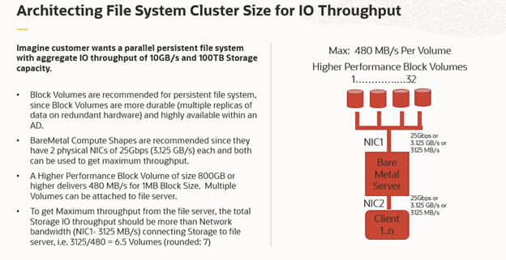

https://www.pass4success.com/oracle/exam/1z0-1089-20

## General
- BM.2.36, 36 cores per node took 4 hours. 4 nodes took 3 hours. What is the efficiency? 
    - [ ] 100%
    - [ ] 66%
    - [x] 75%
    - [ ] 50%

- When would you use HPC
    - [x] Computational Fluid Dynamics
    - [x] Monte Carlo Risk Analysis
- Which is an accurate analogy for Amdahl's law?
    - [ ] There Is no such thing as a free lunch.
    - [ ] An orchestra can only play well together If they have a great conductor.
    - [x] When chopping vegetable to prepare a 4 person-meal, 2 persons are going twice as fast as one, but 8 people may not be 8 times faster.
    - [ ] In track and field, the 4xl00m relay is only 17% faster than the world record for an individual 400m.

- Which Message Passing Interface (MPI) distribution is NOT available today?
    - [ ] Intel MPI
	- [ ] Open MPI
    - [ ] IBM Platform MPI
    - [x] OCI MPI
- You are running a cluster using multiple BM.Standard2.52 machines. The model is on a NFS share running on block volume. You've tried doubling the number of machines but it's not runing any faster. 
    Which two actions could potentially speed up this tightly coupled workload
    - [ ] Switch to FSS for your file system.
    - [x] Use Cluster Networking
    - [x] Use BM.HPC2.36
    - [ ] Switch to ESS mode

- You've spin up a GPU instance with the standard OEL image (GPU version) from the console network on Oracle Cloud Infrastructure (OCI)
    What action do you need to do in order to be able to visualize your desktop remotely.
    - [ ] Install Open MPI for distributed GPU access.
    - [x] Install a desktop and VNC server
    - [ ] Install NVDIA drivers
    - [ ] Open a remote serial console
## Compute
- Which shape is High memory workload 
    - [ ] BM Standard E3 128
    - [ ] BM Standard E2 64
    - [ ] BM HPC 2.36
    - [ ] BM GPU 3.8
- You are comparing different processors for Monte Carlo simulation with millions of single core execution. What frequency will have the highest impact on the "time to solution" 
    - [x] Turbo frequency
        - https://issuu.com/dumpspanda_braindumps32/docs/1z0-1089-20-demo-file
    - [ ] All core turbo frequency
    - [ ] Only the network throughput will influence Monte Carlo simulations
    - [ ] Base frequency

## Network
- A Linux visualization instance in the public subnet with Security List 0.0.0.0 for TCP port 22
    What other rule do you absolutely need to be able to connect remotely.
    - [ ] No other additional rules are needed.
- Which three are available on Oracle Cloud Infrastructure (OCI) as load balancing policies?
    - [x] Least Connections
    - [x] Round Robin
    - [ ] Random
    - [ ] Least CPU Utilization
    - [x] IP Hash
- What are supported protocols in Load Balancer?
    - [x] TCP
    - [x] HTTP
- Which of the following is NOT a valid OCI load balancer shape? Select one.
    - [ ] 10 Mbps
    - [ ] 100 Mbps
    - [ ] 400 Mbps
    - [x] 1000 Mbps
    - [ ] 8000 Mbps
- What is (roughly) the latency between 2 BM.HPC2.36 nodes using RDMA on the same rack?
    - [ ] 1.7 nano seconds
    - [x] 1.7 micro seconds
        - Expected latency intra-rack is ~1.7us
    - [ ] 3 micro seconds
        - the latency between 2 nodes using RDMA on a different rack is 3 microseconds
    - [ ] 0.2 milli seconds
   
- You have an HPC cluster running tightly coupled MPI jobs without VPN or Fast Connect.

    The compute nodes are on subnet2(172.16.1.0/24), and there is a BM.Dense.I02.8 on subnet1 (172-16.0.0/24) that will serve as a bastion and file server.

    What security lists should you choose to be able to run the workloads while limiting access as possible?
    - [ ] Subnet1: 0.0.0.0 for TCP port 22, subnet 1 and 2: 172.16.0.0/23 for all TCP/UDP ports
    - [ ] Subnet1: 0.0.0.0 for all protocols, subnet2: 172.16.0.0/16 for all protocols
    - [x] Subnet1: 172.16.1.0/24 for port 22, subnet2: 172.16.1.0/24 for all protocols
    - [ ] Subnet1: 0.0.0.0 for TCP port 27, subnet 7: 172.16.0.0/16 for TCP port 22
- CIDR 172.16.0.0/16, which following is included
    - [ ] 172.16.32.0/23
    - [ ] 172.16.32.0/16

- What are cluster networks built on?
    - [ ] Built on top of instance pools feature
## Storage
- A file system is built using BM.Standard2.52 Compute shape for File Servers.
    One 25 Gbps vNIC/network card is used to connect to 10 Block Volumes of 1TB each (max. 480MB/s per volume). The other 25 Gbps vNIC is used for sending/receiving data to/from client
nodes. File system client instances who mount the file system are provisioned using VM.Standard2.16 Compute shapes. 
    What is the max IO theoretical throughput a client node can get?
    - [ ] 3125 MB/s
    - [x] 2050 MB/s
    - [ ] 4800 MB/s
    - [ ] 6250 MB/s

- What minimum size of block volume with Balanced performance tier maximizes throughput for large files
    - [ ] 10 TB
    - [ ] 1 TB
    - [x] 32 TB
    - [ ] 100 GB
- Needs to handle large files with a lot of nodes reading at the same time. 
    Which minimum size of block volume maximizes the throughput
    - [ ] 800 GB
    - [ ] 1 TB
    - [ ] 10 TB
    - [ ] 500 GB 
- How are instances distributed in an instance pool?
    - [x] Distributed across all fault domains in a best-effort manner based on capacity.
- What HDFS replication factor should be used for locally attached storage in HDFS?
    - [ ] 1
    - [ ] 2
    - [x] 3
        - This is the answer from the Practise Exam
    - [ ] 4
- A two node clustered/parallel filesystem built using Baremetal Compute shape (BM.Standard2.52) and Block Volume Storage delivers maximum sustained aggregate IO throughput of 5GB/s for read and write, while storing a single copy of the data (replica=l) in filesystem.

    What will be the maximum sustained aggregate IO throughput for read and write, when two copies of the data (replica=2) are stored in filesystem for High Availability?
    - [ ] 5GB/s for both (read and write)
    - [ ] 2.5GB/s for read and 5GB/s for write
    - [ ] 2.5GB/S for write and 5GB/s for read
    - [x] 2.5GB/s for both (read and write)
- What performance benchmark not use for a Linux Filesystem?
    - [ ] IOR
    - [ ] IO500
    - [x] iPerf
    - [ ] FIO
    - [ ] Vdbench
- A customer wants to store small files (KBs) workload in a file system. 
    What two options should you use to measure performance for this system.
    - [ ] CPU processor clock spped for faster processing
    - [ ] Amount of Memory on file servers
    - [x] High IOPS
    - [x] Low Latency
- A customer has a very busy workload. The model is very large (1 PB range) and only some small files are updated for new jobs. Throughput needed during the run is roughly 25GB/s.

    What is a fast and cost-conscious way to handle the file system?

    - [ ] Put the data in object storage, and mount It using s3fs-fuse project.
    - [x] Build a file-system using NVMe on Dense shapes. Then move the data to object storage when not needed.
    - [ ] Build a file system using Block volumes and Standard BMs, take advantage of the different block volume performance levels.
    - [ ] Use NVMe on HPC shapes to build a File System with the RDMA connection.

- What are two different types of Storage offerings available to build a filesystem on Oracle Cloud Infrastructure (OCI)?
    - [x] Local NVMe SSDs on DenseIO and HPC compute shapes
    - [x] Block Volume Service
    - [ ] File Storage
    - [ ] Object Storage

- OCI Block Volume Storage supports sharing a Block Volume among multiple compute instances in read/write or read-only shareable mode. 
    What file system should be used to allow multiple compute instances to read/write data concurrently without any data loss?
    - [x] Parallel File Systems like Lustre, IBM Spectrum Scale(GPFS), BeeGFS, etc
    - [ ] Linux File Systems like XFS, EXT4, EXT3, etc
    - [ ] Network File System (NFS)
    - [x] Distributed File Systems like Gluster, OCFS2, GFS2
- You are building a large filesystem to maximize throughput of large files using high performance block volume and BM standard2.52 as file servers. 
    Which block volume configuration should you choose to ensure aggregate block volume throughput is higher than network bandwidth of file servers.
    - [ ] 7 Block Volumes of 800 GB
    - [ ] 32 Block Volumes of 800 GB
    - [ ] 5 Block Volumes of 32 TB
    - [x] 6 Block Volumes of 32 TB
        - https://www.marks4sure.com/1z0-1089-20-oracle-cloud-infrastructure-2020-hpc-and-big-data-solutions-associate-questions.html
- You are architecting the infrastructure for a file system.
    What are the different criteria you should use, and in what order to build a filesystem for optimal performance?
    - [x] Network Bandwidth > Number of Compute Cores/RAM > Storage
    - [ ] Storage > Network Bandwidth > Number of Compute Cores/RAM
    - [ ] Number of Compute Cores/RAM > Storage > Network Bandwidth
    - [ ] Network Bandwidth > Storage > Number of Compute Cores/RAM

## Operation
- In a job, nodes are known to fail, what should you do?
    - Rerun the job
- What are the two types of autoscaling available on OCI? Select two.
    - [ ] Load based autoscaling
    - [x] Metrics based autoscaling
    - [x] Schedule based autoscaling
    - [ ] Fault based autoscaling

- What are the three components for configuring autoscaling on Oracle Cloud Infrastructure (OCI)
    - [x] Monitoring is enabled on the instances in the instance pool
    - [ ] The instance pool supports the maxinum number of instances that you want to scale to. 
    - [x] You have an instance pool
        - Disagree from https://www.pass4success.com/oracle/exam/1z0-1089-20
    - [x] You have a load balancer
    - [ ] You have Bare Metal instances 
- What performance metrics support for metrics base autoscaling? 
    - [ ] CPU Utilization
    - [ ] Memory Utilization
- When an instance pool scales in, what is the correct order that the instances are terminated?
    - [ ] The number of instances is balanced across availability domains, the oldest instance within the fault domain is terminated, the number of instances is balanced across fault domains.
    - [x] The number of instances is balanced across availability domains, the number of instances is balanced across fault domains, the oldest instance within the fault domain is terminated.
    - [ ] The oldest instance within the fault domain is terminated, the number of instances is balanced across availability domains, the number of instances is balanced across fault domains.
    - [ ] The number of instances is balanced across fault domains, the number of instances is balanced across fault domains, the oldest instance within the fault domain is terminated.

## Big Data
- Which is a common business problem for customers running Big Data workloads?
    - [x] Cost associated to process a large scale data set
    - [ ] Cost associated with Disaster Recovery for large deployments
    - [ ] Ability to process a small data set at the minimum cost as possible
    - [ ] Ability to process a large data set at the maximum cost as possible
- What are some best practices for Big Data Migration?
    - [x] Object storage
    - [x] Data Transfer Appliance
    - [x] FastConnect

- What Big Data solution can run Spark workload
    - [ ] Oracle Data Flow (ODF) 
### Oracle Data Science    
- Which three data sources supported for Oracle Data Science?
    - [ ] Autonomous Data Warehouse
    - [ ] On-premises Oracle Database
    - [x] AWS S3 bucket
    - [x] Azure Blog
    - [x] Google Object Storage
- Which statement is NOT correct?
    - [x] Oracle Data science is augmented with AI VM(??) for Data science
    - [ ] Oracle Data science is not excluded from Universal Credit
    - [ ] Oracle Data science can integrate with Oracle Function.
        - (Oracle Data Science) Integrates with the rest of the OCI stack, including Functions, Data Flow, Autonomous Data Warehouse, and Object Storage.
    - [ ] Oracle Data science does not support per second billing
- Which one is the correct progression of steps when using Accelerated Data Science?
    - [ ] Data Acquisition ---> Feature Engineering ---> Exploratory Data Visualization ---> Model Training
    - [ ] Data Acquisition ---> Hyperparameter optimization ---> Feature Engineering ---> Model Training
    - [x] Data Acquisition ---> Exploratory Data Analysis and Visualization ---> Feature Engineering ---> Model Training
    - [ ] Data Acquisition ---> Feature Engineering ---> Model Training---> Exploratory Data Analysis and Visualization
### Hadoop    
- Which Hadoop distributions are supported on OCI?
    - [ ] Apache Hadoop
    - [x] Cloudera
    - [x] Hortonworks
    - [x] MapR
    - [ ] Pivotal EMC
- What does TeraSort phase of TeraSort benchmark do?
    - [ ] It maps and reduces source data in parallel manner, leveraging data locality to minimize network transfer
    - [x] It randomly maps source data and reduces output to a smaller data set.
        - https://issuu.com/dumpspanda_braindumps32/docs/1z0-1089-20-demo-file
    - [ ] It maps and reduces one terabyte of data into a smaller data set
    - [ ] It randomly maps source data and increases output to a bigger data set.
- Which two storage options are supported directly for direct HDFS use in Hadoop?
    - [ ] Object Storage
    - [x] Block Volume
    - [x] DenseIO NVMe
    - [ ] FSS

## Potential
- Which of the following shapes are available for Data Science Notebook Sessions?
    - [ ] BM.GPU2.1
    - [x] VM.Standard2.1
    - [ ] BM.GPU3.8
    - [x] VM.Standard2.16
        - https://quizlet.com/522060200/hpcbig-data-certification-flash-cards/
- What would you use to run an embarrasingly parallel workload for risk analysis with Monte Carlo?
    The code is homegrown and has not changed much in the last decade. They will use a parallel file system outside of the compute cluster
    - [ ] BM.GPU3.8
    - [x] BM.Standard.E2.64
    - [ ] BM.DenseIO2.52
    - [ ] BM.HPC2.36
    