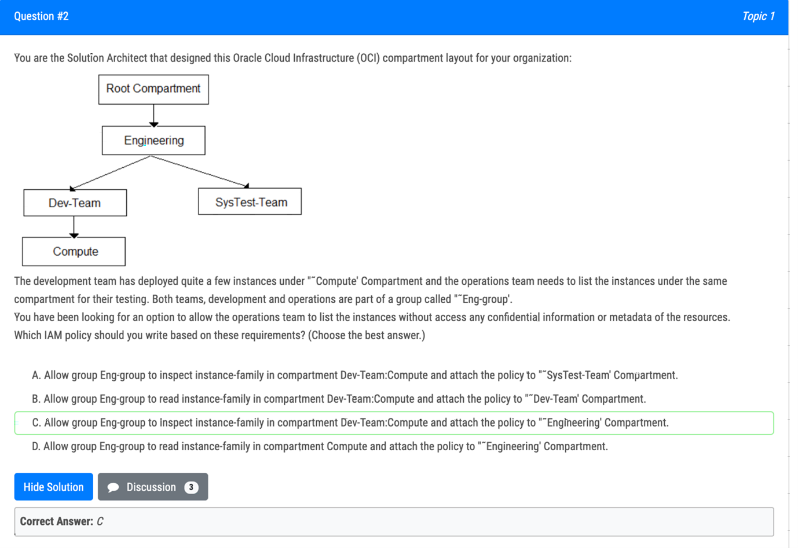
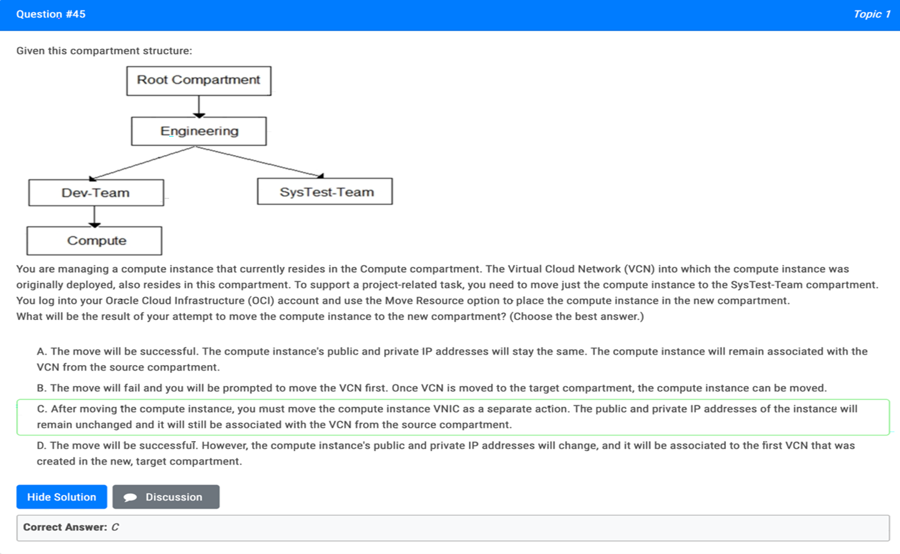
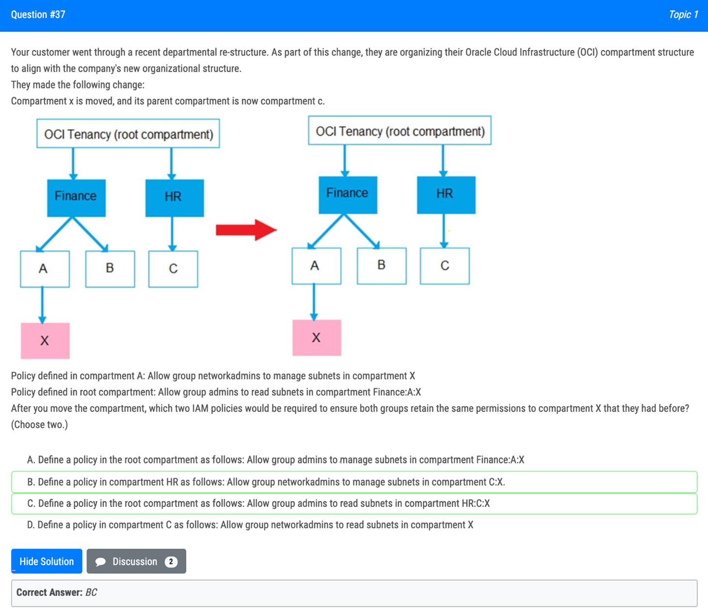
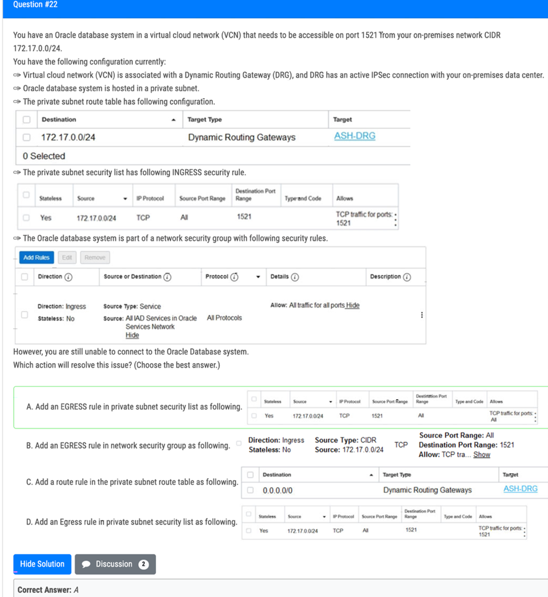

## IAM
1. You are creating an Oracle Cloud Infrastructure **Dynamic Group**. To determine the members of this group you are defining a set of **matching rules**. Which of the following are the supported variables to define conditions in the matching rules? (Choose Two) 
    - [x] `tag.<tagnamespace>.<tagkey> value` - the tag namespace and tag key 
    - [ ] instance.tenancy.id - the OCID of the tenancy where the instance resides.
    - [x] Instance-compartment.id - the OCID of the compartment where the instance reside4; 
    - [ ] lam.policy.ld - the OCID of the IAM polity to apply to the group. 
1.  You are-working as a security consultant with a global insurance organization which is using Microsoft Azure Active Directory (AD) as identity provider to manage user login/passwords. When a user logs in to Oracle Cloud Infrastructure (OCI) console, it should get authenticated by Azure AD. Which set of steps are required to configure at OCI side in order to get it enabled 
    - [ ] Setup Azure AD as an Identity Provider. Import users and groups from Azure AD to OCI. set up IAM policies to govern access to Azure AD groups
    - [ ] Setup Azure AD as an Enterprise Application, map Azure AD users and groups and policies to OCI groups and users 
    - [x] Setup Azure AD as an Identity Provider, map Azure AD groups to OCI groups, set up the IAM policies to govern access to Azure AD groups
    - [ ] Setup Azure AD as an Enterprise Application, configure OCI for Single sign-on, map Azure AD groups to OCI groups, set up the IAM policies to govern access to Azure AD groups 

1. Your organization is using Oracle Cloud Infrastructure (OCI) and wants to setup a disaster recovery plan by **copying block volume backups to another region** at regular intervals. This makes it easier to rebuild applications and data in the destination region if a region wide disaster occurs in the source region. Which IAM Policy statement allows the VolumeAdmins group to copy volume backups between regions? (Choose the best answer.) 
    - [ ] Allow group VolumeAdmins to inspect volume-family in tenancy 
    - [x] Allow group VolumeAdmins to use backups in tenancy 
    - [ ] Allow group VolumrAdmins to manage volumes in tenancy 
    - [ ] Allow group VolumeAdmins to copy volume-backups in tenancy 
    - The aggregate resource type volume-family does not include the VOLUME_BACKUP_COPY permission
        - `Allow group VolumeAdmins to use volume-backups in tenancy where request.permission='VOLUME_BACKUP_COPY'`


1. By copying block volume backups to another region at regular intervals. it makes it easier for you to rebuild applications and data in the destination region if a region-wide disaster occurs in the source region. 
Which IAM Policy statement allows the VolumeAdmins group to copy volume backups between regions 
    - [ ] Allow group VolumeAdmins to use volumes in tenancy 
    - [ ] Allow group VolumeAdmins to copy volume backups in tenancy 
    - [x] Allow group VolumeAdmins to manage volume-family In tenancy 
    - [ ] Allow group VolumeAdmins to inspect volumes in tenancy Answer 
    - The aggregate resource type volume-family does not include the VOLUME_BACKUP_COPY permission
        - `Allow group VolumeAdmins to use volume-backups in tenancy where request.permission='VOLUME_BACKUP_COPY'`

## Cost, Budget, Quota and Service Limit

1. Multiple departments In your company use a shared Oracle Cloud Infrastructure (OCI) tenancy to Implement their projects. You are in charge of managing the cost of OCI resources in the tenancy and need to obtain better Insights Into department's usage. Which three options can you implement together to accomplish this? 
    - [x] Create a budget that matchers your commitment amount and an alert at 100 percent of the forecast
    - [ ] Use the billing cost tracking report to analyze costs. 
    - [ ] Set up a consolidated budget tracking tags to analyze costs in granular manner
    - [x] Set up different compartments for each department then track and analyze cost per compartment
    - [x] Set up a tag default that automatically applies tags to all specified resources created In a compartment then use these tags for cost analysis. 
    - Suspicous: [`Use cost-tracking tags (like cost-center) to allocate cost in more granular ways.`](https://www.oracle.com/a/ocom/docs/cloud/ops-billing-100.pdf)
1. You work for a German company as the Lead Oracle Cloud Infrastructure architect. You have designed a highly scalable architecture for your company's business critical application which uses the Load Balancer service auto which uses the Load Balancer service, auto-scaling configuration for the application servers and a 2 Node VM Oracle RAC database. During the peak utilization period of the-application you noticed that the application is running slow and customers are complaining. This is resulting in support tickets being created for API timeouts and negative sentiment from the customer base. What are two possible reasons for this application slowness? 
    - [ ] Autoscaling configuration for the application servers didn't happen due to IAM policy that's blocking access to the application server compartment
    - [ ] The Load Balancer configuration is not sending traffic to the listener of the application-servers. 
    - [x] Autoscaling configuration-for the application servers didn't happen due to compartment quota breach of the shapes used by the application servers. 
    - [x] Autoscaling configuration for the application servers didn't happen due to service limit breach of the VM shapes used by the application servers 
    - [ ] The Load Balancer doesn't have a Network Security Group to allow traffic to the application servers. 


## Compartment and Tag
1. You have multiple IAM users who launch different types of compute Instances and block volumes every day. As a result, your Oracle cloud Infrastructure (OCF) tenancy quickly hit the service limit and you can no longer create any new instances. As you are cleaning up environment, you notice that the majority of the Instances and block volumes are untagged. Therefore, It is difficult to pinpoint the owner of these resources verify if they are safe to terminate. Because of this, your company has issued a new mandate, which requires adding compute instances. Which option is the simplest way to implement this new requirement? 
    - [ ] Create a policy to automatically tag a resource with the user name. 
    - [ ] Create a policy using IAM requiring users to tag specific resources. This will allow a user to launch compute instances onw if certain tags were defined. 
    - [x] Create tag variables to automatically tag a resource with the user name. 
    - [ ] Create_a default tag for each compartment, which ensure that appropriate tags are applied at resource creation 
    - [ ] Create tag variables for each compartment to automatically tag a resource with the user name. 
1. 
1. You have deployed a multi-tier application with multiple compute instances in Oracle Cloud Infrastructure. You want to back up these volumes and have decided to use Volume Group's feature. The Block volume and Compute instances exist in different compartments within your tenancy. 
Periodically. a few child compartments are moved under different parent compartments. and you notice that sometimes volume group backup fails. 
What could be the cause ? 
    - [ ] You have the same block volume attached to multiple compute instances: if these compute Instances are in different compartments then all concerned compartments must be moved at the same time. 
    - [ ] You are exceeding your volume group backup quota configured. 
    - [x] The Identity and Access Management policy allowing backup failed to move when the compartment was moved. 
    - [ ] compute instance With multiple block volumes attached cannot move when a compartment moved. 
1. 
1. 
1. Your customer has gone through a recent departmental re-structure. As part Of this change, they are organizing their Oracle Cloud Infrastructure (OCI) compartment structure to align with the company's new organizational structure. They have made the following change: <image> Compartment x Is moved, and its parent compartment is now compartment c. Policy defined in compartment A: Allow group networkadmins to manage subnets in compartment X Policy defined in root compartment: Allow group admins to read subnets in compartment Finance A:X After compartment move, which action will provide users of group networkadmins and admins with similar privileges as before the move? 
    - [x] Define a policy in Compartment C as follows: Allow group networkadmins to manage subnets in compartment x 
    - [ ] Define a policy in C as follows: Allow group admins to read subnets in compartment FIR: C:X 
    - [ ] Define a policy in HR as follows: Allow group networkadmins to manage subnets in compartment X Define a policy in C as follows : Allow group admins to read in HR: c:x 
    - [ ] NO change in any policy statement is required as compartments move automatically moves all the policy statements associated With compartments as well. 
1. You are trying to delete a compartment. The delete operation is falling and you need to troubleshoot the problem. VVhich step should NOT be considered when troubleshooting this issue? 
    - [x] Verify that there are no policies In the root compartment that reference the compartment you are trying to delete. 
    - [ ] Verify that you have removed all resources from the compaiment. 
    - [ ] Make sure you have at least one more compartment in your tenancy other than the root compartment. 
    - [ ] Search for resources in the compartment for each region that your tenancy is subscribed to. 
## Compute
1. A customer has a Virtual Machine instance running in their Oracle Cloud Infrastructure tenancy. They realized that they wrongly picked a smaller shape for their compute instance. They are reaching out to you to help them fix the issue. 
Which of the below options is best recommended to suggest to the customer? 
    - [ ] Change the shape of Instance without reboot but stop all the applications running on instance beforehand to prevent data corruption. 
    - [ ] Delete the running instance and spin up a new instance With the desired shape. 
    - [ ] OCI doesn't allow such an operation 
    - [x] Change the shape of the virtual machine instance using the Change Shape feature available in the console. 
1. After performing maintenance on an Oracle Linux compute instance the system is returned to a running state. You attempt to connect using SSH but are unable to do so. You decide to create an instance console connection to troubleshoot the issue. Which three tasks would enable you to connect to the console connection and begin troubleshooting? (Choose three.) 
    - [ ] Stop the compute instance using the Oracle Cloud Infrastructure (OCI) Command Line Interface ICU). 
    - [X] Reboot the compute instance using 3: Oracle Cloud Infrastructure (OCI) Management Console. 
    - [X] Edit the Linux boot menu to enable access to console. 
    - [ ] Upload an API signing key for console connection authentication. E. Use SSH to connect to the public IP address of the compute instance and provide the console connection OCID as the username. 
    - [X] Use SSH to connect to the service endpoint of the console connection service. 
1. Maximum IP address range that we can have for a VCN (Virtual Cloud Network) ? 
    - [x] /16
    - [ ] /20
    - [ ] /24
    - [ ] /12 
1. An organization has its IT infrastructure in a hybrid setup with an on-premises environment and an Oracle Cloud Infrastructure (OCI) Virtual Cloud Network (VCN) in the us-phonix-1 region. The on-premise applications communications with compute instances inside the VPN over a hardware VPN connection. They are looking to implement an Intrusion detected and Prevention (IDS/IPS) system for their OCI environment. This platform should have the ability to scale to thousands of compute of instances running inside the VCN. 
How should they architect their solution on OCI to achieve this goal? 
    - [ ] There Is no need to implement an IPS/IDS system as traffic coming over IPSec VPN tunnels Is already encrypt 
    - [ ] Set up an OCI Private Load Balance! and configure IDS/IPS related health checks at TCP and/or HTTP level to inspect traffic 
    - [ ] Configure autoscaling on a compute Instance pool and set vNIC to promiscuous mode to called traffic across the vcn and send it IDS/IPS platform for inspection.
    - [x] Configure each host with an agent that collects all network traffic and sends that traffic to the IDS/IPS platform tot inspection 
1. You have provisioned a new VM.Dese102.24 compute instance with local NVMe drives. The compute instance is running production application. This is a write heavy application, with a significant Impact to the business it the application goes down. What should you do to help maintain write performance and protect against NVMe devices failure 
    - [ ] NVMe drive; have built in capability to recover themself so no other actions are required 
    - [ ] Configure RAID 6 for NVMe devices.
    - [ ] Configure RAID 1 for NVMe devices. 
    - [x] Configure RAID 10 for NVMe devices. 

## Storage
    
1. Your organization is planning on using Oracle Cloud Infrastructure (OCI) File Storage Service (FSS). You will be deploying multiple_compute instance in Oracle Cloud Infrastructure(OCI) and mounting the file system to these compute instances. The file system will hold payment data processed by a Database instance and utilized by compute instances to create an overall inventory report. You need to restrict access to this data for specific compute instances and must be allowed/blocked per compute instance's CIDR block. 
Which option can you-use to secure access? 
    - [ ] Use stateless Security List rule to restrict access from known IP addresses only. 
    - [ ] Create and configure OCI Web Application Firewall service With built in DNS based intelligent routing. 
    - [ ] Create a new VCN security list, choose SOURCE TYPE as Service and SOURCE SERVICE as FSS. Add stateless ingress and egress rules for specific P address and CIDR blocks.
    - [x] Use 'Export option' feature of FSS to restrict access to the mounted file systems. 
1. A data analytics company has been building Its now generation big data and analytics platform on Oracle cloud Infrastructure (OCI). They need a storage service that provide the scale and performance that their big data applications require such as high throughput to compute nodes with low latency file operations in addition, their data needs to be stored redundantly across multiple nodes In a single availability domain and allows concurrent connections from multiple compute Instances hosted on multiple availability domains. Which OCI storage service can you use to meet this requirement? 
    - [ ] Object Storage
    - [x] File System Storage
    - [ ] Archive storage
    - [ ] Block Volume
1. You are a solutions architect for a global health care company which has numerous data centers around the globe. Due to the ever growing data that your company is storing, you were Instructed to-set up a durable, cost effective solution to archive your data from your existing on-premises tape based backup Infrastructure to Oracle Cloud Infrastructure (OCI). What is the most-effective mechanism to Implement this requirement? 
    - [ ] Setup an on premises OCI Storage Gateway which will back up your data to OCI object Storage Standard tier. Use Object Storage life cycle policy management to move any data older than 30 days from Standard to Archive tier. 
    - [ ] Setup fastConnect to connect your on premises network to your OCI VCN and use rsync tool to copy your data to OCI Object Storage Archive tier. 
    - [ ] Use the File Storage Service in OCI and copy the data from your existing tape based backup to the shared file system 0 Setup an on-promises OCI Storage Gateway which will-back up your data to OCI Object Storage Standard 
    - [x] Setup an on premises OCI Storage Gateway which rill back up your data to OCI Object Storage Archive tier. 

1. A company has an urgent requirement to migrate 300 TB of data to Oracle Cloud Infrastructure (OCI) In wo weeks. Their data center has been recently struck by a massive hurricane and the building has been badly damaged, although still operational. They have a 100 Mbps Internet line but the connection is Intermittent due to the damages caused to the electrical grid in this scenario, what is the most effective service to use to migrate the data to OCI given the time constraints? 
    - [ ] Setup a OCI Storage Gateway to connect your data center and your VCN. Once the connection has been established, upload all data to OCI using OCI Storage Gateway Cloud Sync tool. 
    - [ ] Setup a hybrid network by launching a 1Gbps FastConnect virtual circuit between your data center and OCI. Use OCI Object storage multipart upload tool to automate the migration of your data to OCI. 
    - [x] Use multiple OCI Data Transfer Appliances to transfer data to OCI. 
    - [ ] Upload the data to OCI using OCI Object Storage multipart upload tool. 
    - [ ] Storage Gateway to connect your data center and your VCN. Once the connection has been established, upload all data to OCI. 
1. As a part of migration exercise for an existing on-premises application to Oracle Cloud Infrastructure (OCT), you are required to transfer a 7 TB file to-OCI Object Storage. You have decided to upload functionality of Object Storage. Which two statements are true? 
    - [x] Active multipart upload can be checked by listing all parts that have been uploaded, however It Is not possible to list information for individual object part in an active multipart upload 
    - [ ] It is possible to spill this file into multiple parts using the APIs provided by Object Storage. 
    - [ ] It is possible to split this file into multiple parts using rclone tool provided by Object Storage. 
    - [x] After initiating a multipart upload by making a CreateMultIPartUpload RESI API Call, the upload remains active until you explicitly commit it or abort. 
    - [ ] Contiguous numbers need to be assigned for each part so that Object Storage constructs the object by ordering, part numbers in ascending order 
1. You are running a legacy application in a compute instance on Oracle Cloud Infrastructure (0C1). To provide enough space for it to store internal data, a block volume is attached to the instance in paravirtualized mode. Your application is not resilient to crash-consistent backup. What should you do to backup the block volume in a secure and cost effective war (Choose the best answer.) 
    - [ ] Save your application data, detach the block volume and create a clone. 
    - [x] Create a volume group, add the boot volume and then run the volume group backup. 
    - [ ] Create a backup, detach the block volume and save your application data. 
    - [ ] Save your application data, detach the block volume and create a backup. 
1. An online registration system Is currentlOosted on one large Oracle Cloud Infrastructure (OCT) Bare metal compute Instance with attached block volume to store of the users' data 
    1. The registration system accepts the Information from the user, Including documents and photos then performs automated verification and processing to check it the user is eligible for registration. 
    1. The registration system becomes unavailable at tunes when there is a surge of users using the system the existing architecture needs improvement as it takes a long time for the system to complete the processing and the attached block volumes are not large enough to use data being uploaded by the users. 
    Is the most effective option to achieve a highly scalable solution? 
    - [ ] Attach more Block volumes as the data volume increase, use Oracle Notification Service (ONS) to distribute tasks to a pool of compute instances working In parallel, and Auto scaling to dynamicallvsize the pool of Instances depending on the number of notifications received from the Notification Service. Use Resource Manager stacks to replicate your architecture to another region. 
    - [x] Change your architecture to use an OCI Object Storage standard tier bucket, replace the single bare metal instance with a Oracle Streaming Service (OSS) to ingest the Incoming requests and distribute the tasks to a group of compute Instances with Auto Scaling
    - [ ] Upgrade your architecture to use a pool of Bare metal servers and configure them to use their local SSOs for faster data access Set up Oracle Streaming Service (09 to distribute the tasks to the pool of Bare metal Instances with Auto Scaling to dynamically increase or decrease the pool of compute instances depending on the length of the Streaming queue. 
    - [ ] Upgrade your architecture to use more Block volumes as the data volume Increases. Replace the single bare metal instance with a group of compute instances with Auto Scaling to dynamically increase or decrease the compute instance pools depending on the traffic. 

1. To serve web traffic for a popular product, your cloud engineer has provisioned four BM.Standard2.52 instances, event spread across two availability domains in the us-asbum-1 region: Load Balancer is used to deliver the traffic across instances. 
After several months,.the product grows even more popular and you need additional compute capacity. As a result, an engineer provisioned two additional VM.Standard2.8 instances. You register the-two VM. Standard2. 8 Instances with your load Balancer Backend sot and quickly find that the VM Standard2.8 Instances running at 100% of CPU utilization but the BM.Standard2 .52 instances have significant CPU capacity that's unused. Which option is the most cost effective and uses instances capacity most effectively? 
    - [ ] Configure Load Balancer with two VM Standard2.8 instances and use Auto scaling Instant pool to add up to two additional VM instances. Shut off BM.Standard2.52 instances. 
    - [ ] Route traffic to BM.Standard2.52 and VM Standard2.8 instances directly using DNS and Health Checks. Shut off the load Balances. 
    - [ ] Configure Autoscaling instance pool with Load Balancer to add up to 3 more BM.Standard2.52-Instances when triggered. Shut off VM.Standard2.8 instances. 
    - [x] Configure your Load Balance, with weighted round robin policy to distribute traffic to the compute instances, with more weight assigned to bare metal instanc 
1. You Two Machines as below: 
    Option A : VM with 1TB block volume attached 
    Option B : VM with two 500GB block volume attached with raid 0 configuration 
    - [ ] A and B have same throughput and IOPS performance 
    - [ ] A is having better throughput and IOPS performance in comparison to B
    - [ ] B is having highest level of throughput but lower IOPS performance 
    - [x] B is having higher IOPS but lower throughput performance in comparison to A 
1. A cloud consultant is working on implementation project on OCI. As part of the compliance requirements. the objects placed in object storage should be automatically archived first and then deleted. He is testing a Lifecycle Policy on Object Storage and created a policy as below: 
```
[( "name": "Archive doc", "action": "ARCHIVE", "objectNameFilter" :{ "inclusionPrefixes": "doc"] "timeAmount": 5, "timeunit": "DAYS", "isEnabled": true}, ("name": "Delete_doc", "action": "DELETE". "objectNameFilter": "inclusionPrefixes":{ "doc"] 1."timeAmount": 5, "timeunit": "DAYS", "isEnabled": true ) 
```
What will happen after this policy is applied? 
    - [ ] All the objects having file extension ".doc" will be archived 5 days after object creation 
    - [ ] All the objects with names starting with "doc" will be archived 5 days after object creation and Will be deleted 5 days after archival
    - [x] All objects with names starting With "doc" will be deleted after 5 days of object creation
    - [ ] All the objects having file extension "doc" Will be archived for 5 days and be deleted 10 days after object creation 
1. A civil engineering company is running an online portal In which engineers can upload their constructions photos, videos, and other digital files. There is a new requirement for you to implement: the online portal must offload the digital content to an Object Storage bucket for a period of 72 hours. After the provided time limit has elapsed, the portal will hold all the digital content focally and wait for the next offload period. Which option fulfills this requirement? 
    - [ ] Create a pre-authenticated URL for the entire Object Storage bucket to read and list the content with an expiration of 72 hours.
    - [ ] Create a pre authenticated URL lot each object that Is uploaded to the Object Storage bucket with an expiration of 72 hours.
    - [ ] Create a Dynamic Group with matching rule for the portal compute Instance and grant access to the Object Storage bucket for 72 hours. 
    - [x] Create a pre authenticated URL for the entire Object Storage bucket to write content with an expiration of 72 hours. 
1. You work for a public health care company based in the United Slates. Their existing patient records system runs in an ompremise data center and the customer is sending tape backups offsite as part of their disaster recovery planning. You developed an alternative archival solution using Oracle Cloud Infrastructure @co that will save the company a significant amount of money on a yearly basis. The solution involves storing data in an OCI Object Storage bucket. After reviewing your solution with the customer Global Risk and Compliance (CRC) team, they highlighted four security requirements: (w All data less than 1 year old must be accessible within 2 hours o All data must be retained for at least 10 years and be accessible-within 48 hours sh MI data must be encrypted at rest sh No data may be transmitted across the public intemet Which two options meet the requirements outlined by the customer CRC team? (Choose two.) 

    - [ ] Provision a FastConnect link to the closest OCI region and configure a private peering virtual circuit. 
    - [x] Provision a FastConnect link to the closest OCI region and configure a public peering Virtual circuit. 
    - [x] Create an OCI Object Storage Standard tier bucket. Configure a lifecycle policy to archive any object that is older than 365 days. 
    - [ ] Create an OCI Object Storage Standard tier bucket. Configure a lifecycle policy to delete any object that is older than 7 years. 
    - [ ] Create a VPN connection between your on-premises data center and OCI. Create a Virtual Cloud Network (VCN) along with an OCI Service Gateway for OCI Object Storage. 


## Auto Scaling
1. You are working as a solutions architect for an online retail stare in Frankfurt which uses multiple compute instance VMs spread among three availability domains in the eu-frankfurt-1 region. You noticed the website is having very high traffic, so you enabled autoscaling to suffice the needs of your application but, you observed that one of the availability domains is not receiving any traffic. What could be wrong in this situation? (Choose the best answer.) 
    - [ ] Autoscaling only works with single availability domains.
    - [ ] You forgot to attach a load balancer to your instance pool configuration.
    - [ ] You have to manually add all three availability domains to-your load balancer configuration.
    - [x] Autoscaling is using an Instance Pool configured to create instances in two availability Domains. 
    - [ ] Autoscaling can be enabled for multiple availability domains only in uk-london-1 region. 

1. You work for a bank as the lead Oracle Cloud Infrastructure architect. You designed a highly scalable solution for your company's banking application. The architecture includes a load balancer, application servers with autoscaling configuration based on CPU utilization, and an Autonomous Database with Transaction Processing workload type running in a Virtual Cloud Network (VCN). During the peak utilization period, the application users complain that' the application runs slow. What are two possible reasons for the application running slow at times? (Choose two.) 
    - [ ] The VCN does not have a Network Security Group configured to allow traffic from the load balancer to all the application servers in the backend set. 
    - [x] Instance pool in autoscaling configuration for the application servers did not scale out due to compartment quota breach of the VM shapes used by the application Servers. 
    - [ ] Theload balancer is not configured correctly to send traffic to all the listeners of the application servers in the backend set. 
    - [ ] Instance pool in autoscaling configuration for the Autonomous Database did not scale out due to misconfigured scaling policy. 
    - [x] Instance pool in autoscaling configuration for the application servers did not scale out due to service limit breach of the VM shapes used by the application servers. 
1. An upcoming e-commerce company has deployed their online shopping application on OCI. The application was deployed on compute instances with auto-scaling configuration for application servers fronted by a load balancer and OCI Autonomous Transaction Processing (ATP) in the backend. In order to promote their e-commerce platform 50% discount was announced on all the products for a limited period. During the day I of promotional period it was observed that the application is running slow and company's hotline is flooded with complaints. What could be two possible reasons for this situation? 
    - [ ] The health check on some of the backend servers has failed and the load balancer was rebooting these servers. 
    - [x] The auto-scaling has already scaled to the maximum number of instances specified in the configuration and there is no room of scaling
    - [ ] As part of auto-scaling, the load balancer shape has dynamically changed to a larger (s'hape to handle more incoming traffic and the system was slow for a short time during this change
    - [x] The health check on some of the backend servers has failed and the load balancer has taken those servers temporarily out of rotation 
1. An online stock trading application is deployed to multiple Availability Domains in the us-phoenix-1 region. Considering the high volume of financial transactions that the trading application handles, the company has hired you to ensure that the data stored by the application is scalable, highly-available, and disaster resilient. In the event of failure, the Recovery Time Objective (RTO) must be less than 2 hours to meet regulatory compliance requirements. Which Disaster Recovery strategy should be used to achieve the RTO requirement in the event of system failure? (Choose the best answer.) 
    - [x] Configure your application to use synchronous master-slave data replication between Availability Domains. 
    - [ ] Configure hourly block volumes backups through the Storage Gateway service. 
    - [ ] Store hourly block volumes backup to NVME device under a compute instance and generate a custom image every 5 minutes. 
    - [ ] Configure hourly block volumes backups using the Oracle Cloud Infrastructure (OCI) Command Line Interface (CLI). 
1. An upcoming e-commerce company has deployed their online shopping application on OCI. The application was deployed on compute instances with autoscaling configuration for application servers fronted by a load balancer and OCI Autonomous Transaction Processing (ATP) in the backend. In order to promote their e-commerce platform 50% discount was announced on all the products for a limited period. During the day 1 of promotional period it was observed that the application is running slow and company's hotline is flooded with complaints. 
What could be two possible reasons for this situation? 
    - [ ] The health check on some of the backend servers has failed and the load balancer was rebooting these servers.
    - [x] The autoscaling has already scaled to the maximum number of instances specified in the configuration and there is no room of scaling
    - [ ] As part of autoscaling, the load balancer shape has dynamically changed to a larger shape to handle more incoming traffic and the system was slow for a short time during this change.
    - [x] The health check on some of the backend server has failed and the load balancer has taken those servers temporarily out of rotation 

## Security

1. You are asked to create a user that will access programmatic endpoints in OCI. This user must not be allowed to authenticate by username and password. Which two authentication options can you use? 
    - [ ] PEM Certificate file
    - [x] Auth tokens 
    - [x] API signing key
    - [ ] SSH key pair
    - [ ] Windows password 

1. Which three types of credentials are used to manage Oracle Cloud Infrastructure Identity and Access Management (IAM)? 
    - [ ] Windows Password
    - [x] API Signing Key
    - [x] Swift Password
    - [ ] SSH Key
    - [x] Console Password 
1. A digital marketing company is planning to host a website on Oracle Cloud Infrastructure (OCI) and leverage OCI Container Engine for Kubernetes (OKE). The web server will make API calls to access OCI Object Storage to store all images uploaded by users. 
For security purpose, your manager instructed you to ensure that the credentials used by the web server to allow access not stored locally on the compute instance. What solution results in an Implementation with the least effort for this scenario? 
    - [x] Configure the credentials using Instance Principal to allow the web server to make API calls to OCI Object Storage
    - [ ] Configure the credentials using OCI Registry (OCIR) which will automatically connect with OKE allowing the web server to make API calls to OCI Object Storage. 
    - [ ] Configure the credentials-to use Transparent Data Encryption (TDE) which will automatically allow the web server to make API calls to OCI Object Storage.
    - [ ] Configure the credentials using OCI Key Management to allow an instance to make API calls and grant access to OCI Object Storage. 

1. You are developing a Serverless function for your company's loT project. This function should access Oracle Cloud Infrastructure (OCI) Object Storage to store some files. You choose Oracle Functions to deploy this function on OCI. However, your security team doesn't allow you to carry any API Token or RSA Key to authenticate the function against the OCI API to access the Object Storage. What-should you do to get this function to access OCTObject Storage without carrying any static authentication files? (Choose the best answer.) 
    - [x] Set up a Dynamic Group using the format below: 
        ```
        ALL ( resource. type = `fnfunc` , resource.compartment.id = `ocidl.compartment.ocl..aaaaaaaa23_____smwa`}
        ```
        Create a policy using the format below to give access to OCI Object Storage: 
        ```
        allow dynamic-group acme-func-dyn-grp to manage objects in compartment acme-storage-compartment where all {target.bucket.name= `acme-functions-bucket`}
        ```
        Include a call to a `resource principal provider` in your function code as below: 
        `signer = oci.auth.signers.get_resource_principals_signer()`
    - [ ] Add these two policy statements for your compartment and then include a call to a —resource principal provider' in your function code: Allow group acme-functions-developers to inspect repos in tenancy Allow group acme-functions-developers to manage repos in tenancy where all (target.repo.name=/acme-web-app*/) 
    - [ ] There is no way that you can access the OCI resources from a running function. 
    - [ ] Add these two policy statements for your compartment to give your function automatic access to all other OCI resources: Allow group <group-name> to manage fn-app in compartment <compartment-name> Allow group <group-name> to manage fn-function in compartment <compartment-name> 
    
1. An insurance company is storing critical financial data in the OCI block volume. This volume is currently encrypted -using oracle managed keys. Due to regulatory compliance, the customer wants to encrypt the data using the keys that they can control and not the keys which are controlled by Oracle. 
What of the following series of tasks are required to encrypt the block volume using customer managed keys? 
    - [x] Create a vault, create a master encryption key In the vault assign this master encryption key to the block volume
    - [ ] Create a master encryption key, create a data encryption key; decrypt the block volume using existing oracle managed keys, encrypt the block volume using the data encryption key
    - [ ] Create a vault, import your master encryption key into the vault, generate data encryption key, assign data encryption key to the block volume
    - [ ] Create a master encryption key. create a new version of the encryption key. decrypt the block volume using existing oracle managed keys-and encrypt using new version of the encryption key 
1. Your conrpany will soon start moving critical systems into Oracle Cloud Infrastructure (OCI) platform. These systems will reside in the us-phoenix-1 and us- ashbum-1 regions. As part of the migration planning, you are reviewing the company's existing security policies and written guidelines for the OCI platform usage within the company. Your security processes for critical systems require that all data is encrypted at rest using Customer-Managed Keys. Which two options ensure compliance with this policy? (Choose two.) 
    - [ ] You do not need to perform any additional actions because the OCI Block Volume service always encrypts all block volumes, boot volumes, and volume backups at rest by using the Advanced Encryption Standard (AES) algorithm with 256-bit encryption. 
    - [x] When you create a new OCI Object Storage bucket through OCI console, you need to choose 'ENCRYPT USING CUSTOMER-MANAGED KEYS' option. 
    - [x] When you create a new block volume through OCI console, select 'Encrypt using Customer-Managed Keys' checkbox and use encryption keys generated and stored in OCI Vault. 
    - [ ] When you create a new compute instance through OCI console, you use the default options for 'configure boot volume' to speed up the process to create this compute instance. 
    - [ ] When you create a new compute instance through OCI console, you use the default shape to speed up the process to create this compute instance. 
1. You are working as a security consultant with a global insurance organization which Is using Microsoft Azure Active Directory (AD) as Identity provided to manager user login/passwords. When a user logs in to Oracle Cloud Infrastructure (OCI) console. it should get authenticated by Azure AD. 

    Which set of steps are required to configure at OCI side in order to get it enabled 
    - [ ] Setup Azure AD as an Identity Provider, import users and groups from Azure AD to OCI, set up IAM policies to govern access to Azure AD groups
    - [ ] Setup Azure AD as an Enterprise Application, map Azure AD users, groups and policies to OCI groups and users
    - [x] Setup Azure AD as an Identity Provider, map Azure AD groups to OCI groups, set up the IAM policies to govern access to Azure AD groups
    - [ ] Setup Azure AD as an Enterprise Application, configure OCI for single sign-on, map Azure AD groups to OCI groups, set up the IAM policies to govern access to Azure AD groups
    
1. A hospital in Austin has hosted its web based medical records portal entirely In Oracle cloud Infrastructure (OCI) using Compute Instances for its web-tier and DB system database for its data tier. To validate compliance with Health Insurance Portability and Accountability (HIPAA), the security professional to check their systems it was found that there are a lot of unauthorized coming requests coming from a set of IP addresses originating from a country in Southeast Asia. 
Which option can mitigate this type of attack? 
    - [ ] Block the attacking IP address by creating by Network Security Group rule to deny access to the compute Instance where the web server is running 
    - [x] Block the attacking IP address by implemepting a OCI Web Application Firewall policy using Access Control Rules
    - [ ] Mitigate the attack by changing the Route fable to redirect the unauthorized traffic to a dummy Compute instance
    - [ ] Block the attacking IP address by creating a Security List rule to deny access to the subnet where the web server is running
    
1. You are building a highly available and fault tolerant web application deployment for your company. Similar application delayed by competitors experienced web site attack including DDoS which resulted in web server failing. 
You have decided to use Oracle Web Application Firewall (WAF) to implement an architecture which will provide protection against such attacks and ensure additional configuration will you need to implement to make sure WAF is protecting my web application 24x7. 
Which additional configuration will you need to Implement to make sure WAF Is protecting my web application 24x7? 
    - [ ] Configure auto scaling policy and it to WAF instance. 
    - [ ] Configure Control Rules to send traffic to multiple web servers 
    - [x] Configure multiple origin servers 
    - [ ] Configure new rules based on now vulnerabilities and mitigations 
1. A new international hacktivist group, based in London, launched wide scale cyber attacks including SQL Injection and Cross-Site Scripting (XSS) across multiple websites which are hosted in Oracle Cloud Infrastructure (OCI). As an IT consultant you must configure a Web Application Firewall (WAF) to protect these websites against the attacks. How should you configure your WAF to protect the website against those attacks? (Choose the best answer.) 
    - [ ] Enable a Protection Rule to block the attacks based on HTTP Headers that contain XSS and SQL strings. 
    - [ ] Enable an Access Rule to block the IP Address range from London. 
    - [x] Enable a Protection Rule to block requests XSS Filters Categories and SQL Filters Categories.
    - [ ] Enable a Protection Rule to block requests that came from London. 
    - [ ] Enable an Access Rule that contains XSS Filters Categories and SQL Filters Categories. 
1. By default, What is the maximum number of security lists that can be associated with a subnet upon creation? 
    - 5
1. When creating a subnet, one or more placeholder security lists are often associated with the subnet. Why? 
    - [ ] Each operator needs its own security list. 
    - [ ] Each protocol needs its own security list. 
    - [x] Each network endpoint or instance in the subnet needs its own security list. 
    - [ ] It is not possible to add or remove security lists after a subnet is created. 
1. An Oracle Cloud Infrastructure (OCI) Public Load Balancer's SSL certificate is expiring soon. You noticed the Load Balancer is configured with SSL Termination only. When the certificate expires, data traffic can be interrupted and security compromised. 
What steps do you need to take to prevent this situation? 
    - [x] Add the new SSL certificate to the Load Balancer, update backend servers to work with a new certificate and edit listeners so they can use the new certificate bundle.
    - [ ] Add the new SSL certificate to the Load Balancer, update listeners and backend sets so they can use the new certificate bundle. 
    - [ ] Add the new SSL certificate to the Load Balancer and implement end to end 551 so It can encrypt the traffic from clients all the way to the backend servers. 
    - [ ] Add the new SS1 certificate to the Load Balancer and update backend servers to use the new certificate bundle. 
    - [ ] Add the new SSL certificate to the Load Balancer and update listeners to use the new certificate bundle. 


## Network
1. You are working as a solution architect for an online retail store to create a portal to allow the users to pay for their groceries using credit cards. Since the application is not fully compliant with the Payment Card Industry Data Security Standard (PCI DSS), your company is looking to use a third party payment service to process credit card payments. The third party service allows a maximum of Spelunk IP addresses 5 public IP addresses at a time However, your website is using Oracle Cloud Infrastructure (OCI) Instance Pool Auto Scaling policy to create up to 15 Instances during peak traffic demand, which are launched in VCN private subnets and attached to an OCI public Load Balancer. Upon user payment, the portal connects to the payment service over the Internet to complete the-transaction. What solution can you implement to make sure that all compute Instances can connect to the third party system to process the payments aw peak traffic demand? 
    - [x] Route credit card payment request from the compute instances through the NAT Gateway. On the third-party services, whitest the public IP associated with the NAT Gateway. 
    - [ ] Whitelist the Internet Gateway Public IP on the third party service and route all payment requests through the Internet Gateway. 
    - [ ] Create an OCI Command Line Interface (CLI) script to automatically reserve public IP address for the compute instances. On the third services, whitelist the Reserved public IP. 
    - [ ] Route payment request from the compute instances through the OCI Load Balancer, which will then be routed to the third party service 
    
1. The Finance department of your company has reached out to you. They have customer sensitive data on compute Instances In Oracle Cloud Infrastructure (OCI) which they want to store in OCI Storage for long term retention and archival. To meet security requirements they want to ensure this data is NOT transferred over public Internet, even if encrypted which they want to store In OCI Object Storage fit long term retention and archival. 
Which option meets this-requirements? 
    - [ ] Configure a NAT instance and all traffic between compute In Private subnet should use this NAT instance with Private IP as the route target. 
    - [ ] Use NAT gateway with appropriate route table when transferring data. Then use NAT gateways' toggle (on/off) once data transfer is complete. 
    - [x] Use Service gateway with appropriate route table. 
    - [ ] Use Storage gateway with appropriate firewall rule. 
    
1. You are helping a customer troubleshoot a problem. The customer has several Oracle Linux servers in a private subnet within a Virtual Cloud Network (VCN). The servers are configured to periodically communicate to the Internet to get security patches for applications installed on them. The servers are unable to reach the interne. An Internet Gateway hasbeen deployed in the public subnet in the VCN and the appropriate routes are configured in the Route Table associated with the public subnet. Based on cost considerations, which option will fix this issue? (Choose the best answer) 
    - [x] Create a NAT gateway in the VCN and configure the NAT gateway as the route target for the private subnet. 
    - [ ] Create another Internet Gateway and configure it as route target for the private subnet.
    - [ ] Create a Public Load Balancer in front of the servers and add the servers to the Backend Set of the Public Load Balancer. 
    - [ ] Implement a NAT instance in the public subnet of the VCN and configure the NAT instance as the route target for the private subset. 

1. You are designing the network infrastructure for two application servers: appserver-1 and appserver-2 running in two different subnets inside the same Virtual Cloud Network (VCN) Oracle Cloud Infrastructure (OCI). You have a requirement where your end users will access appserver-1 from the internet and appserver-2 from the on-premises network. The on-premises network is connected to your VCN over a FastConnect virtual circuit. How should you design your routing configuration to meet these requirements? 
    - [ ] Configure a single routing table (Route Table-I) that has two set of Riles. One that has route to internet via the internet Gateway and another that propagate specific routes for the on-premise network via the Dynamic Routing Gateway. Associate the routing table with all the VCN subnets. 
    - [ ] Configure a single routing table (Routing Table-I) that has two set of rules: one that has route to internet via the Internet Gateway and another that propagates specific routes for the on-premises network via Dynamic Routing Gateway (DRG). Associate the routing table with the VCN. 
    - [x] Configure two routing tables: Route Table-1 that has a route to internet via the Internet gateway. Associate this route table to the subnet containing appserver-1. Route Table-2 that propagate specific routes for the on-premises network via the Dynamic Routing Gateway (DRG) Associate this route table to subnet containing appserver-2. 
    - [ ] Configure two routing table (Route table-I Route Table-2) that have rule to route all traffic via the Dynamic Routing Gateway (DRG) Associate the two routing tables with all the VCN subnets. 

1.  
1. Your customer recently ordered for a 1-Gbps Fast Connect connection In .ap-tokyo-1 region of Oracle Cloud Infrastructure (OCI). They will use this to one Virtual cloud Network (VCN) in their production (OCI) tenancy and VCN In their development OC)tenancy. As a Solution Architect, how should you configure and architect the connectivity between on premises and VCNs In OCI? 
    - [ ] Create two private virtual circuits on the FastConnect link. Create two Dynamic Routing Gateways, one for each VCNs. Attach the virtual circuits to the dynamic routing gateways.
    - [ ] You cannot achieve connectivity using single FastConnect link as the production and the development VCNs-are in separate tenancies. Request one more FastConnect connection. 
    - [ ] Create a single private virtual circuit over fastConnect and attach FastConnect to either of the VCN's-are in separate tenancies. Request one more fastConnect connection. 
    - [ ] Create a single private virtual circuit over FastConnect and attach fastConnect and the development VCNs-ire in separate tenancies. Request one more FastConnect connection.
    - [x] Create a hub-VCN that uses Dynamic Routing Gateway (DRG) to communicate with on-premises network over FastConnect. Connect the hub-VCN to the production VCN spoke and with development VCN spoke, each peered via their respective local Peering Gateway (LPG) 

1. A retail company has several on-premises data centers which span multiple geographical locations. They plan to move some of their applications from on-premises data centers to Oracle Cloud Infrastructure (OCI). for these applications running in OCI. they still need to interact with applications running on their on-premises data centers. These applications require highly available, fault-tolerant network connections between on premises data centers and OCI. 
Which option should you recommend to provide the highest level of redundancy? 
    - [ ] Oracle cloud Infrastructure provides network redundancy by default so that no other operations are required.
    - [ ] If your data centers span multiple, geographical locations, use only the specific IP address as a static route for the specific geographical location 
    - [x] Set up both IPSec VPN and FastConnect to connect your on premises data centers to Oracle Cloud Infrastructure. 
    - [ ] Use FastConnect private peering only to ensure secure access from your data center to Oracle Cloud Infrastructure
    - [ ] Set up a single IPSec VPN connection from your data center to Oracle Cloud Infrastructure since It Is cost effective 

1. A retail company has recently adopted a hybrid architecture. They have the following requirements for their end-to-end connectivity model between their on- premises data center and Oracle Cloud Infrastructure (OCI) region. o Highly available connection with service level redundancy o Dedicated network bandwidth with low latency Which connectivity setup Is the most cost-effective solution for this scenario? (Choose the best answer.) 
    - [x] Setup FastConnect virtual circuit as your primary connection, and an IPSec VPN as a backup connection. Use separate edge devices in your on-premises data center for each connection. From your edge devices, advertise more specific routes through FastConnect virtual circuit, and less specific routes through the backup IPSec VPN path. 
    - [ ] Setup IPSec VPN as your primary connection, and a FastConnect virtual circuit as a backup connection. Use separate edge devices in your on-premises data center for each connection. From your edge devices, advertise mom specific routes through IPSec VPN, and less specific-routes through the backup FastConnect virtual circuit. 
    - [ ] Setup FastConnect virtual circuit as your primary connection, and a second FastConnect virtual circuit as a backup connection. Make sure your FastConnect physical connectivity is redundant. Use a single edge device in your on-premises data center for each connection. From your edge device, advertise mom specific routes via primary FastConnect virtual circuit, and less specific routes through the backup FastConnect virtual circuit. 
    - [ ] Setup IPSec VPN as your primary connection, and a second IPSec VPN as a backup connection. Use separate edge devices in your on-premises data center for each connection. From your edge devices, advertise more specific routes via primary IPSec VPN, and less specific routes through the backup IPSec VPN. 

1. A retail company has several on-premises data centers which saw multiple geographical locations  They plan to move some of their applications from on-premises data centers to Oracle Cloud Infrastructure (OCI). For these applications running in OCI. they still need to interact with applications running on their on-premises data centers. These applications require highly available, fault-tolerant network connections between on premises data centers and OCI. 
Which option should you recommend to provide the highest level of redundancy? 
    - [ ] Oracle cloud Infrastructure provides network redundancy by default so that no other operations are required
    - [ ] If your data centers span multiple, geographical locations, use only the specific IP address as a static route for the specific geographical location
    - [x] Set up both IPSec VPN and FastConnect to connect your on premises data centers to Oracle Cloud Infrastructure.
    - [ ] Use FastConnect private peering only to ensure secure access from your data center to Oracle Cloud Infrastructure
    - [ ] Set up a single IPSec VPN connection (rom your data center to Oracle Cloud Infrastructure since It is cost effective 

1. You are working as a solution architect with a global automotive provider who is looking to create a multi-cloud solution. They want to run their application tier in Microsoft Azure while utilizing the Oracle DB Systems in the Oracle Cloud Infrastructure (OCI). What is the most fault tolerant and secure solution for this customer? 
    - [ ] Create an Oracle database in OCI Virtual Cloud Network (VCN) and connect to the application tier running In Microsoft Azure over the Internet. 
    - [x] Create a FastConnect virtual circuit and choose Microsoft Azure from the list of providers available to setup Network connectivity between application tier running in Microsoft Azure Virtual Network and Oracle Databases running In OCI Virtual Cloud (VCN) 
    - [ ] Use OCI Virtual Cloud Network remote peering connection to create connectivity among application tier running in Microsoft Azure Virtual Network and Oracle Databases running in OCI Virtual Cloud Network(VCN). 
    - [ ] Create a VPN connection between the application tie, running in Azure Virtual Network and oracle Databases running In OCI Virtual Cloud Network (VCN). 

1. You have designed and deployed your Autonomous-Data Warehouse (ADW) such that it is accessible from your on-premises data center and servers running on both private and public networks in Oracle Cloud Infrastructure (OCI). As you are testing the connectivity to your ADW database from the different access paths, you notice that the server on the private network is unable to connect to ADW. Which two steps do you need to take to enable connectivity from the server on the private network to ADW? 
    - [ ] Add an entry in the Security List of the ADW allowing ingress traffic for CIOR block 10.2.2.0/24 ❑ Add an entry in the route table (associated with the private subnet) with destination of0.0.0.0/: target type of NAT Gateway, add a stateful egress rule to the security list (associated With the private subnet) with destination of 0.0.0.0./0 and for all IP protocols 
    - [x] Add an entry in the access table list of ASW for CIDR block 10220/24. 
    - [ ] Add an entry in the route table (associated with the private subnet) With destination of0.0.0.0./0: target type of Internet Gateway, add a stateful egress in the security list (associated with the private subnet) With destination of 0.0.0.0/0 and for all IP protocols. 
    - [x] Add an entry the access control list of ADW for IP address 129.146.160.11 

    
1. You are in the process of setting up a highly available student registration website on Oracle Cloud Infrastructure (OCI). You use a load balancer and a database service on OCI. You launch two compute instances each in a different subnet and add them to the back end set of a public load balancer. The load balancer is configured correctly and working. You then deploy the student registration application on these two compute instances. The application can communicate with the database service. However, when you type the URL of this student registration application in your browser, no web page appears. What could be the cause ? 
    - [x] The security lists of the subnets on which the two instances are located do not have "allow" rules for port 80 and 443. 
    - [ ] The load balancer performed a health check on the application and found that compute instances were not in a healthy state and terminated the instances. 
    - [ ] The client requested https access to the application and the load balancer service does not support end-to-end SSL from the client to the listener to the back-end set. 
    - [ ] The Dynamic Routing Gateway is preventing the client traffic from your data center network from reaching the public IP of the load balancer. 

1. You are an administrator with an application running on OCI. The company has a fleet of OCI compute virtual instances behind an OCI Load Balancer. The OCI Load Balancer Backend Set health check API is providing a 'Critical' level warning. You have confirmed that your application is running healthy on the backend servers. What is the possible reason for this 'Critical' warning ? 
    - [ ] A user does not have correct IAM credentials on the Backend Servers. 
    - [ ] The Backend Server VCN's Route Table does not include the route for OCI LB.
    - [ ] OCI Load Balancer Listener is not configured correctly. 
    - [x] The Backend Server VCN's Security List does not include the IP range for the source of the health check requests. 

1. Which DNS resource record type is used to point a host name to an IP address ? 
    - [ ] ALIAS
    - [x] `A`
    - [ ] CNAME 
    - [ ] `AAAA`

1. Which two are true for Oracle Cloud Infrastructure DNS ?
    - [ ] It can function only as a primary DNS. 
    - [x] It supports other cloud providers such as AWS and Azure. 
    - [x] It supports segregation of traffic by using the private pool.
    - [ ] lt does not provide DDoS protection. 
### Network: Load Balencer
1. Which two are required parameters to create a public load balancer instance? 
    - [ ] back end set
    - [ ] listener 
    - [x] load balancer name 
    - [x] two public subnets
    - [ ] certificate 
1. A retail company runs their online shopping platform entirely on Oracle Cloud Infrastructure (Deg. This is a 3-tier web application that includes a 100 Mbps Load Balancer, Virtual Machine Instances for web and application tiers, and an Oracle DB Systems Virtual Machine. Due to unprecedented growth, they noticed an increase in the incoming traffic to their website and all users start getting 503 (Service Unavailable) errors. What is the potential problem in this scenario? (Choose the best answer.) 
    - [ ] You did not configure a Service Gateway to allow connection between web servers and Load Balancer. 
    - [ ] The Traffic Management Policy is not set to Load Balancer the traffic to the web servers. 
    - [ ] The Load Balancer heath check status indicates critical situation for half of the backend web servers. 
    - [ ] The Database is down hence users cannot access the web site. 
    - [x] All the web servers are too busy and not able to answer any request from users. 
1. You have deployed a web application targeting a- global audience across multiple Oracle Cloud Infrastructure (OCI) regions. You decide to use Traffic Management Geo-Location based Steering Policy to serve web requests to users from the region closets to the user. Within each region you have deployed a public load balancer with 4 servers in a backend set. During a DR test disable all web servers in one of the regions however, traffic Management does not automatically direct all users to the other region. Which two are possible causes? 
    - [ ] You did not setup a Route Table associated with load Balancer's subnet 
    - [x] You did not setup an HTTP Health Check associated with Load Balancer public IP In the disabled region. 
    - [ ] Rather than using Geo-Location based Steering Policy, you should use Failover Policy Type to serve traffic. 
    - [ ] One of the two working web servers In the other region did not pass Its HTTP health check 
    - [x] You did not correctly setup the Load Balancer HTTP health check policy associated with backend set 


### Network: OCI Traffic Management
1.  A global retailer is setting up the cloud architecture to be deployed in Oracle Cloud infrastructure (OCI) which will have thousands of users from two major geographical regions: North America and Asia Pacific. The requirements of the services are:   
    \* Service needs to be available 24/7 to avoid any business disruption   
    \* North-American customers should be served by application running In North American regions   
    \* Asia Pacific customers should be served by applications running In Asia Pacific regions   
    \* Must be resilient enough to handle-the outage of an entire OCI region   
    - [ ] OCI DNS, Traffic Management with Failover steering policy
    - [x] OCI DNS, Traffic Management with Geolocation steering policy. Health Checks 
    - [ ] OCI DNS, Traffic Management with Geolocation steering policy 
    - [ ] OCI DNS, Traffic Management with Load Balancer steering policy, Health-Checks 
1. A large financial company has a web application hosted in their on-premises data center. They are migrating their application to Oracle Cloud Infrastructure (OCI) and require no downtime while the migration is on-going. In order to achieve this, they have decided to divert only 30% of the application works fine, they divert all traffic to OCI. As a solution architect working with this customer, which suggestion should you provide them? 
    - [ ] Use OCI Traffic management with failover steering policy and distribute the traffic between OCI and on premises infrastructure. 
    - [x] Use OCI Traffic management with Load Balancing steering policy and distribute the traffic between OCI and on premises infrastructure. 
    - [ ] Use an OCI load-Balancer and distribute the traffic between OCI and on premises infrastructure. 
    - [ ] Use VPN connectivity between on premises Infrastructure and OCI, and create routing tables to distribute the traffic between them. 
    
1. A customer is in a process of shifting their web based Sales application from their own data center located in US West to OCI India West (Mumbai) region. They want to do it in a controlled manner and initially only 1% of the traffic will be steered to the servers in OCI. After verification of everything is working as expected. the company is gradually planning to increase the ratio until they are comfortable with fully migrating all traffic to OCI. 
Which of the following solution can- be used in this situation? 
    - [ ] OCI DNS and-Traffic Management With Geolocation Steering policy 
    - [ ] OCI DNS and OCI Load Balancer Service 
    - [ ] OCI DNS and Traffic Management With Failover Steering policy 
    - [x] OCI DNS and Traffic Management With Load Balancer Steering policy 

1. As a solution architect, you are designing a web application to be deployed across multiple Oracle Cloud Infrastructures (OCI) regions for a global audience. Your goal is that users from each region should access the application web servers deployed in their own geographical OCI location. Which OCI feature can be used to achieve this? 
    - [ ] OCI Global Load balancers
    - [ ] OCI Public Load Balancers
    - [ ] OCI Traffic Management IP Prefix steering policy
    - [x] OCI Traffic Management GeoLocation steering policy
1. A retailer bank is currently hosting their mission critical customer application on-premises. The application has a standarcL3 tier architecture -4 application servers process the incoming traffic and store application data in an Oracle Exadata Database Server. The bank has recently had service disruption to other inter applications to they are looking to avoid this issue for their mission critical Customer Application. 
Which Oracle Cloud Infrastructure services should you recommend as part of the DR solution? 
    - [ ] OCI DNS Service, Public Load Balancer, Oracle Database Cloud Backup Service, Object Storage Service, Oracle Bare Metal Cloud Service, Oracle Bare Metal Cloud Service with GoldenGate, OCI Container Engines for K8S, Oracle IPSec VPN 
    - [ ] OCI Traffic Management, Private Load Balancer, Compute instances distributed across multiple Availability Domains and/or Fault Domains, Exadata Cloud Service with Data Guard, Oracle FastConnect, Object Storage, Database Cloud backup module 
    - [x] Traffic Management, Public toad Balancer, Compute instances distributed across multiple Availability Domains and/or Fault domains. Exadata Cloud Service with Data Guard, Oracle FastConnect, Object Storage, Database cloud backup module
    - [ ] OCI DNS Service, Load Balancer as a service using Public Load Balancer distributing traffic Compute Instance across multiple regions, Oracle RAC Database using Virtual Machines, Remote Peering connecting two VCRs in different regions. Exadata Cloud Service with GoldenGate FastConnect, Object Storage, Database Cloud backup module
1. You are tasked with building a highly available, fault tolerant web application for your current employer. The security team is concerned about an increase in malicious web-based attacks across the internet and asked what you can do to add a higher level of security to the website. How should you architect the solution on Oracle Cloud Infrastructure (OCI) to meet all requirements defined by your organization? (Choose the best answer.) 
    - [x] Deploy at least 3 web application servers, each in a different fault domain, using a regional private subnet. Place a public load balancer in a regional public subnet and create a backend set for all of the web application servers. Deploy a Web Application Firewall (WAF) and configure the load balancer public IP address as the origin. 
    - [ ] Deploy at least 3 web application servers, each in a different fault domain, using a regional private subnet. Place a public load balancer in a regional public subnet and create a backend set for all of the web application servers. Create a Geolocation steering policy in Traffic Management and add an answer pool that directs to the public IP address of the load balancer. Configure a global catch-all rule to use this answer pool. 
    - [ ] Deploy at least 3 web application servers, each in a different fault domain, using a regional public subnet. Ensure that each web application server is assigned a public IP address. Deploy a Web Application Firewall (WAF) and configure one Origin for each public IP address. 
    - [ ] Deploy at least 3 web application servers, each in a different fault domain, using a regional public subnet. Use the OCI Traffic Management service to create a load balancing policy that will resolve DNS evenly between all web servers. 
1. You are tasked with migrating an online shopping website to Oracle Cloud Infrastructure (OCI) and decide to use a Load Balancer. You have configured the backend set with the round robin policy. During the testing phase, you noticed that users are losing items from their shopping carts when they navigate to different pages. 
How should you implement a solution to this problem? 
    - [ ] Replace the round robin policy with least connections policy at the backend
    - [x] Set up session persistence at the Load Balancer backend
    - [ ] Set up a Traffic Management Steering Policy to redirect traffic to a different backend set that is deployed exclusively for the purpose of holding all items placed in the shopping cart. 
    - [ ] Configure a set of path route rules that will route to different backend sets based on the URI requested by the customer's browser. 


## OCI Streaming Service
1. A startup company is looking for a solution for processing of data transmitted by the 107 devices fitted-to transport vehicles that carry frozen foods. The data should be consumed and processed in real time. The processed data should be archived to OCI Object Storage bucket. and-use Autonomous Data warehouse (ADW) to handle analytics. Which architecture will help you meet this requirement? 
    - [x] Use OCI Streaming Service to collect the Incoming biometric data. Use Oracle Functions to process the date and show the results on a real-time dashboard and store the results 10 OCI Object Storage. Store the data In OCI Autonomous Data warehouse (ADW) to handle analytics. 
    - [ ] Launch an open source Hadoop cluster to collect the Incoming biometrics data Use an Open source Fluentd cluster to analyze the- data me results to OCI Autonomous Transaction Processing (ADW)to handle complex analytics 
    - [ ] Create an OCI Object Storage bucket to collect the incoming biometric data from the smart pet collar Fetch the data horn OCX Object storage to OCI Autonomous Data Warehouse (ADW) every day and run analytics lobs With it 
    - [ ] Use OCI Streaming Service to collect the Incoming biometric data. Use an open source Hadoop cluster to analyze the data horn streaming service. Store the results to OCI Autonomous Data warehouse (ADW) to handle complex analytic 
1. You are working with a social media company as a solution architect. The media company wants to collect and analyze large amounts of data being generated from their websites and social media feeds to gain insights and continuously improve the user experience. In order to meet this requirement, you-have developed a micro services application hosted on Oracle Container Engine for Kubernetes. The application will process the data and store the result to an Autonomous Data Warehouse (ADW) instance. Which Oracle Cloud Infrastructure (OCI) service can you use to collect and process a large volume of unstructured data in real time? 
    - [ ] OCI Events
    - [x] OCI Streaming
    - [ ] OCI Resource Manager
    - [ ] OCI Notifications 
1. You are working as a cloud engineer for an IOT startup company which is developing a health monitoring pet collar for dogs and cats. The company collects biometric Information of the pet every second and then sends it to Oracle Cloud Infrastructure (OCI) Your task is to come up with an architecture which will accept and process-the monitoring data as well as provide complete trends and health reports to the pet owners. The portal should be highly available, durable, and scalable with an additional feature for showing real time biometric data analytics. which architecture will help you meet this requirement? 
    - [ ] Use OCI Streaming Service to collect the incoming biometric data. Use Oracle Functions to process the data and show the results on a real-time dashboard and store the results to OCI Object Storage Store the data. In OCI autonomous Data warehouse (ADW) to handle analytics. 
    - [ ] Launch an open source Hadoop cluster to collect the Incoming biometrics:data Use an Open source Fluentd cluster to analyze the- data me results to OCI Autonomous Transaction Processing (ADW)to handle complex analytics 
    - [ ] Create an OCI Object Storage bucket to collect the incoming biometric data from the smart pet collar. Fetch the data from OCI Object Storage to OCI Autonomous Data Warehouse (ADW) every day and run analytics Jobs with it 
    - [x] Use OCI Streaming Service to collect the incoming biometric data. Use an open source Hadoop cluster to analyze the data from streaming service. Store the results to OCI Autonomous Data warehouse (ADW) to handle complex analytics. 

1. You are working as a cloud consultant for a major media company. In the US and your client requested to consolidate all of their log streams, access logs, application logs, and security logs into a single system. The client wants to analyze all of their logs In real-time based on heuristics and the result should be validated as well. This validation process requires going back to data samples extracted from the last 8 hours. What approach should you take for this scenario? 
    - [ ] Create an auto scaling pool of syslog-enabled servers using compute instances which will store the logs In Object storage, then use map reduce jobs to extract logs from Object storage, and apply heuristics on the logs. 
    - [ ] Create a bare-metal instance big enough to host a syslog enabled server to process the logs and store logs on the locally attached NVMe SSDs for rapid retrieval of logs when needed. 
    - [ ] Set up an OCI Audit service and ingest all the API trails from Audit service pragmatically to a client side application to apply heuristics and save the result in an OCI Object storage. 
    - [x] Stream all the logs and cloud events of Events service to Oracle Streaming Service. Build a client process that will apply heuristics on the logs and store them in an Object Storage. 

## Oracle K8S Engine
1. A global retailer has decided to re-design its e-commerce platform to have a micro-services architecture. They would like to decouple application architecture into smaller, independent services using Oracle Cloud application instances. They have decided to use both containers and servers' technologies to run these application instances. Which option should you recommend to build this new platform? 
    - [ ] Install a kubernetes cluster on OCI and use OCI event service. 
    - [x] Use Oracle Container Engine for kubernetes, OCI Registry and OCI Functions. 
    - [ ] Use OCI Resource Manager to automate compute instances provisioning and use OCI Streaming service. 
    - [ ] Use OCI functions, OCI object storage and OCI event service. 
1. You are working for a Travel company and your travel portal application is a collection of microservices that run on Oracle Cloud Infrastructure Container Engine for Kubemetes. As per the recent security overview, you have noticed that Oracle has published a newer image of the Operating System used by the worker nodes. You want to make sure that your application doesn't face any downtime but at the same time the worker nodes gets upgraded to the latest version of the Operating System. What should you do to get this upgrade done without application downtime? (Choose the best answer.) 
    - [ ] 1. Shutdown the worker nodes 2. Create a new node pool 3. Manually schedule the pods on the newly built node pool 
    - [ ] 1. Create a new node pool using the latest available Operating System image. 2. Run kubectl cordon <node name, against all the worker nodes in the old pool to stop any new application pods to get scheduled 3. Run kubectl drain <node name> •—deletelocardata "-force —ignore-daemonsets to evict any Pods that are running 4. Delete the old node pool 
    - [ ] 1. Create a new node pool using the latest available Operating System image 2. Run kubectl taint nodes all node—role.kubernetesio/master- 3. Delete the old node pool 
    - [x] 1. Run kubectl cordon <node name, against all the worker nodes in the old pool to stop any new application pods to get scheduled 2. Run kubectl drain <node name? ....deletelocardata forcengnoredaemonsets to evict any Pods that are running 3. Download the patches for the new Operating System image 4. Patch the worker nodes to the latest Operating System image 

1. You work for a retail company and they developed a Microservices based shopping application that needs to access Oracle Autonomous Database from the application. As an Architect, you have been tasked to treat all of the application components as Kubernetes native objects, such as the microservices, Oracle Autonomous database, Kubernetes services, etc. What should you do to make sure that you can use Kubernetes constructs to manage the life cycle of the application components, including Oracle Autonomous Database? (Choose the best answer.) 
    - [ ] Create an Oracle Cloud Infrastructure (OCI) Service Gateway and connect to the Oracle Autonomous Database using the private IP address from the microservice. 
    - [ ] Provision an Oracle Autonomous Database and then use OCI Service Broker to access the database as a native component to your Kubernetes cluster. 
    - [ ] Create a service from the Kubernetes cluster and point to the Oracle Autonomous Database using its FODN. 
    - [x] Install and secure the OCI Service Broker for Kubernetes. Then provision and bind to the required Oracle Cloud Infrastructure services. 
    - Reference: https://docs.cloud.oracle.com/en-us/Mas/Content/ContEng/Tasks/contengaddingservicebrokers.htm 
1. You work for a large bank where security and compliance are critical. As part of the security overview meeting, your company decided to minimize the installation of local tools on your laptop. You have been running Ansible and kubectl to spin up Oracle Container Engine for Kubernetes (OKE) clusters and deployed your application. For authentication, you are using an Oracle Cloud Infrastructure (OCI) CLI config file that contains OCIDs, Fingerprint, and a locally stored PEM file. Your security team doesn't want you to store any local API key and certificate. or any other local tools. Which two actions should you perform to spin up the OKE cluster and interact With it? (Choose two.) 
    - [ ] Create a developer workstation on OCI. Install Ansible and kubectl on it. Use resource principal to authenticate against OCI API and create the OKE Cluster. 
    - [ ] Develop your own code using OM SDK to deploy the OKE cluster. 
    - [x] Work on OCI Cloud Shell to use built-in Ansible and kubectl to deploy the OKE cluster. Use OCI_CLI_AUTHrinstance_obo_user environment variable to authenticate using built•in token. 
    - [ ] Work on OM Cloud Shell to use built-in Ansible and kubectl to deploy the OKE cluster. Bring in your own config file and certificate to authenticate against OCI API. 
    - [x] Create a developer workstation on OCI. Install Ansible and kubectl on it. Use instance principal to authenticate against OCI API and create the OKE Cluster. 
    - Reference: htlps://oraclecloud-infrastructure-ansible-modulesseadthedocsioren/latest/modulesrocLcluster_module.html 
    
1. A FinTech startup is developing a new blockchain based application to provide-Smart Contracts using micro-services architecture. The development team is planning-to deploy the application using containers and looking for a reliable way to build, deploy and manage their cloud-native application. Additionally, they need an easy way to store, share and manage their application artifacts. Which option should you recommend for this application? 
    - [ ] Use Oracle Container Engine for Kubernetes (OKE) to manage the deployment environment and OCI Functions for application artifacts 
    - [ ] Install and manage a Kubernetes cluster on OCI Compute Instances and use OCI Resource Manager for management of application artifacts 
    - [x] Use Oracle Container Engine for Kubernetes (OKE) to manage of cloud-native applications and OCI Registry for application artifacts
    - [ ] Use and OCI Resource Manager to manage cloud-native application and make the application artifacts available OCI functions 

## Fn and Oracle Functions
1. Your company has recently deployed a new web application that uses Oracle functions. Your manager Instructed you to Implement major manage your systems core effectively. You know that Oracle functions automatically monitors functions on your behalf reports metrics through Service Metrics. Which two metrics are collected and made available by this feature? 
    - [x] length of time a function runs
    - [ ] number of times a function is removed
    - [x] number of times a function is invoked
    - [ ] amount of CPU used by a function
    - [ ] number of concurrent connections 
1. You want to automate the processing of new Image files to generate thumbnails. the expected rate is 10 new files every hour. Which of the following is the most cost-effective option to meet this requirement in Oracle Cloud Infrastructure (OCI)? 
    - [ ] Upload files to an OCI Object storage bucket. Every time a file is uploaded. trigger an event With an action to provision a compute Instance With a cloud-init script to access the file. process it and store it back in an Object storage bucket Terminate the instance using Autoscaling policy after the processing is finished. 
    - [x] Upload files to an OCI Object storage bucket. Every time a file is uploaded. an event is emitted. Write a rule to filter these events with an action to trigger a function In Oracle Functions The function processes the image in the file and stores the thumbnails back in an Object storage bucket. 
    - [ ] Upload all files to an Oracle Streaming Service (0$5) stream. Set up a cron job to Invoke a function in Oracle functions to fetch data from the stream Invoke another function to process the image files and generate thumbnails. Store thumbnails in another OSS stream. 
    - [ ] Build a web application to ingest the files and save them to a NoSQL Database. Configure OCI Events service to trigger a notification using Oracle Notification Service (ONS). ONS Invokes a custom application to process the mage files to generate thumbnails. Store thumbnails in a NoSQL Database table 

1. A global media organization is working on a project which lets users upload their videos on their site. After upload is complete, the video should be automatically processed by an Al algorithm. The algorithm will try to recognize actions in the videos so that it can be used to show related advertisements in future. The development team wants to focus on writing Al code and don't want to worry about underlying infrastructure for high-availability, scalability. security and monitoring. Which OCI services should you recommend for this project? 
    - [ ] Use OCI Events service for triggering automatic processing of video, Oracle Container Engine for Kubernetes (OKE) and OCI Digital Assistant
    - [ ] Use Oracle Container Engine for Kubernetes (OKE) for deployment of Al Code, OCI Notifications and Object Storage 
    - [ ] Use OCI Resource Manager to manage the underlying infrastructure. OCI Functions and OCI Events service. 
    - [x] Use Object Storage for storing videos. OCI Events service and OCI Functions 
1. Your company developed a function that needs to access the Oracle Database to inject some data to it at runtime. You are tasked to move this function to the Oracle Cloud Infrastructure (OCI) and use Oracle Functions and access Oracle Autonomous Database. You created a Dockerfile below to run this function, however, you are getting this error `cx_Oracle.DatabaseError: ORA-12560: TNS:protocol adapter error`. 
    <u>Dockerfile</u>
    ```
    FROM oraclelinux:7 -slim 
    RUN yum -y install ozacle-release-e17 oracle-nodejs-release-e17 && \
        yum-config-manager --disable- o17_developer_EPEL && \ 
        yum -y install ozacle-instantclient19.3-basiclite nodejs && \
        rm -rf /var/cache/yum 
    WORRDIR /function 
    ADD . /function/ 
    RUN npm install 
    
    CMD exec node func.js
    ```
    What should you do to make sure that Oracle Functions can run this Dockerfile properly? (Choose the best answer.) 
    - [x] Add these two lines to your Dockerfile: groupadd """gid 1000 fn 88 adduser --uid 1000 "'Mid fn fn 
    - [ ] Use "privileged flag while running the Docker container to add runtime privilege 
    - [ ] Use —cap-add=ALL flag while running the Docker container to add runtime capability 
    - [ ] You need to run this Container as root, so add this line: USER root 

## Monitor, Metrics

1. You work for a large bank where your main application is a payment processing gateway API. You deployed the application on Oracle Container Engine for Kubernetes (OKE) and used API Gateway with several policies to control the access of the API endpoint. However, your customers are complaining about the unavailability of the API endpoint. Upon checking, you noticed that the Gateway URL is throwing Service Unavailable error. You need to check the backend latency and backend responses when this error started last night. What should you do to get this data? (Choose the best answer.) 
    - [ ] Check with the application owner and search the log file for the container to get the metrics from the log file. 
    - [ ] Go to Governance Menu and click on Audit to see the Audit log for the API Gateway. Filter it using Start and End date with a 503 response status. 
    - [ ] Go to Developer Services and click on API Gateway. Go to the detail page of the gateway and select Metrics. Change the Start and End time to filter the metrics. 
    - [x] Go to Monitoring and click on Service Metrics. Choose the Metric Namespace as oci_apigateway. Change the Start and End time accordingly. Add a Dimension and select http Status Code: 503. Check the backend latency and backend responses metric. 
    - Reference: https://docs.cloud.oracle.com/en-us/iaas/Content/APIGateway/Reference/apigatewaymetrics.htm 
1. Your team is conducting a Root Cause Analysis (RCA) following a recent unplanned outage. One of the block volumes attached to your production Weblogic server w?? deleted and you have been tasked with identifying the source of the action. You search the Audit logs and find several Delete actions that occurred in the previous 24 hours. Given the sample excerpt of this event: 
    ```
    "event": {
        "tenantId":"ocidl.tenancy.ocl....",
        "compartmentID": "ocid1.compartment.oc1.....",
        "compartmentName":"Production",
        "eventId":"...",
        "eventName":"DeleteVolume",
        "eventSource":"BlockVolumes",
        "eventType":"ServiceAPI",
        "principalId":"....",
        "credentialId":"",
        "requestAction":"DELETE",
        "requestId":"...",
        "requestAgent":"Mozilla/5.0 (Windows NT 10.0; Win64; x64) AppleWebKit/537.36 (KHTML, like Gecko) Chrome/75.0.3770.14..."
        "requestHeaders": {
            ...
        }
        "requestOrigin":"129.254.11.219",
        "requestResource":"/20160918/volumes/ocid1.volume.oc1.iad...."
        "responseStatus":"204'
    }
    ```
    Which item from the event log helps you identify the individual or service that initiated the DeleteVolume API call? (Choose the best answer.) 
    - [ ] eventld
    - [ ] reguestAgent
    - [ ] eventource
    - [ ] reguesterrgin 
    - [x] principalld 
    
## OCI CLI
1. You are part of a project team working in the development environment created in OCI. You have realized that the CIDR block specified for one of the subnet in a VCN is not correct and want to delete the subnet. While deleting you are getting an error indicating that there are still resources that you must delete first. The error includes the OCID of the VNIC that is in the subnet. 
Which of the following action you will take to troubleshoot this issue? 
    - [ ] Use OCI CLI to delete the subnet using --force option
    - [ ] Copy and Paste OCID of the VNIC in the search box of the OCI Console to find out the parent resource of the VNIC
    - [ ] Use OCI CLI to delete the VNIC first and then delete the subnet
    - [x] Use OCI CLI to call "GetVnic" operation to find out the parent resource of the VNIC 
## Terraform and OCI Resource Manager
1. Which three can you achieve by using Terraform? 
    - [x] Create resources in the right order without regard to the order in the terraform plan file.
    - [x] Automatically re-provision the resources that are tainted or whose configuration has changed. 
    - [ ] Automatically translate a deployed infrastructure and create a plan.
    - [x] Automatically destroy all the resources that are in tenancy. 
    - [ ] Continuously maintain the configuration files in an instance. 
1. What does Terraform use to create, manage, and manipulate infrastructure resources ? 
    - [ ] resources
    - [ ] provisioner
    - [ ] instances
    - [x] provider 

1. Which three are valid Terraform configuration components? 
    - [x] Variable
    - [ ] Region
    - [ ] Metadata
    - [ ] instance
    - [x] Resource
    - [ ] Data source 
    - Note: Provider and Output are also valid Terraform configuration components 
1. In which language are Terraform and Terraform providers written ? 
    - [ ] Python
    - [x] Go 
    - [ ] C
    - [ ] Ruby 
1. Configuration formats supported by Terraform (IaaC)? (Choose two.) 
    - [ ] YAML (.yml file extension) 
    - [x] JSON (.tf.json file extension) / Machine-readable
    - [x] HCL (HashiCorp Configuration Language format) / .tf file extension /human-readable
    - [ ] XML (.xml file extension) 
1. What happens when you run terraform plan? 
    - [ ] It configures, reconfigures, and instantiates resources and their dependencies. 
    - [x] It shows the operator the course of action that would be taken if a change is applied.
    - [ ] It deletes all existing resources and re-creates them. 
    - [ ] It shows a dependency graph. 

## Database
1.  A cost conscious fashion design company which sells bags, clothes, and other luxury items has recently decided to move all of the their on-premises infrastructure to Oracle Cloud Infrastructure (OCI), One of their on-premises application is running on an NGINX server and the Oracle Database is running in a 2 node Oracle Real Application Clusters (RAC) configuration. Based on cost considerations, what is an effective mechanism to migrate the customer application to OCI and set up regular automated backups? 
    - [ ] Launch a Compute instance and run an NGINX Serve to host the application. Deploy a 2 node VM-DB Systems with Oracle RAC enabled Import the on premises database to OCI VM DB Systems using data pump and then enable automatic backup. Also, enable Oracle Data Guard on the database server 
    - [x] Launch a compute Instance and run an run an NGINX server to host the application Deploy a 2 node VM DB Systems with oracle RAC enabled import the on premises database to OCI VM DB Systems using oracle Data Pump and then enable automatic backups.
    - [ ] Launch a compute Instance and run an NGINX server to host the application. Deploy Exadata Quarter Rack, enable automatic backups and import the database using Oracle Data Pump. 
    - [ ] Launch a compute Instance for both the NGINX application server and the database server. Attach block-volumes on the database server compute instance and enable backup policy to backup the block volumes. 

1. An automobile company wants to deploy their CRM application for Oracle Database on-Oracle Cloud Infrastructure (OC I) DB Systems for one of major clients. In compliance with the Business Continuity Program of the client, they need to provide a Recovery Point objective (RPO) of 24 hours and a Recovery time objective (RTO) of 1 hour. The CRM application should be available oven in me event that an entire on Region is down. Which approach Is the most suitable and cost effective configuration for this scenario? 
    - [x] Deploy a 1 node VM Oracle database in one region and replicate the database to a 1 node VM Oracle database in another region using a manual setup and configuration of Oracle Data Guard. 
    - [ ] Deploy a 2 node Virtual Machine (VM) Oracle RAC database in one region and replicate the database to a 2 node VM Oracle RAC database in another region using a manual setup and configuration of Oracle Data Guard.
    - [ ] Deploy a 1 node VM Oracle database in one region. Manual Configure a Recovery Manager (RMAN) database backup schedule to take hourly database backups. Asynchronously copy the database backups to object storage in another OCI region, If the primary OCI region is unavailable launch a new 1 new VM Database in the other OCI region restore the production database from the backup 
    - [ ] Deploy an Autonomous Transaction Processing (Serverless) database in one region and replicate it to an Autonomous Transaction Processing (Serverless) database in another region Oracle GoldenGate. 

1. Which three options are available to migrate an Oracle database 12.x from an on-premises environment to Oracle Cloud Infrastructure (OCI)? 
    - [ ] Leverage OCI Storage Gateway asynchronous database migration option. 
    - [x] Use Oracle Data Pump Export/Import to migrate the database. 
    - [x] Configure RMAN cross-platform transportable tablespace backup sets. 
    - [ ] Setup OCI schema and data transfer tool with Bare Metal DB Systems as the target.
    - [x] Create a backup of your on-premises database in OCI DB Systems. 
1. All three Data Guard configurations are fully supported on Oracle Cloud Infrastructure (OCI). You went to deploy a maximum availability architecture (MAA) for database workload. 
Which option should you consider while designing your Data Guard configuration to ensure best RIO and RPO without causing any data loss? (Choose the best answer.) 
    - [x] Configure "Maximum Availability" mode in SYNC mode between two availability domains (same region), and use the Maximum Availability mode in ASYNC mode between two regions. 
    - [ ] Configure 'Maximum Protection mode which provides zero data loss if the primary database fails. 
    - [ ] Configure "Maximum Satiability* mode which provides the highest level of scalability without compromising the availability of the primary database. 
    - [ ] Configure "Maximum Performance mode in SYNC mode between two availability domains (same region) which provides the highest level of data protection that is possible without affecting the performance of the primary database. 
    
1. A manufacturing company is planning to migrate their on-premises database to OCI and has hired you for the migration. Customer has provided following information regarding their existing on-premises database: 
Database version, host operating system and version, database character set, storage for data staging, acceptable length of system outage. 
What additional information do you need from customer in order to recommend a suitable migration method? Choose two 
    - [x] On-premises host operating system and version
    - [ ] Elapsed time since database was last patched
    - [ ] Number of active connections
    - [x] Data types used in the on-premises database
    - [ ] Top 5 longest running queries 

1. A large London based eCommerce company Is fuming Oracle DB Systems What Machine RAC database on Oracle Cloud Infrastructure (OCI) for their eCommerce application in the uk4 ordon-1 region. They are currently taking automatic backups of the database, as configured during the database provisioning activity. They are launching a new product soon, which Is expected to sell In large quantities all over the world. The application architecture should have minimal cost no data loss. no performance impacts during the database backup windows and should have minimal downtime. What is the most efficient and cost-effective mechanism of modifying the database deployment architecture to meet these application goals? (Choose the best answer.) 
    - [ ] Launch a new VM RAC database in another availability domain, launch a compute instance. deploy Oracle GoldenGate on it and then configure it to replicate the data from the eCommerce Database over to the new VM RAC database using GoldenGate. Take backups from the new VM RAC database. 
    - [ ] Turn off automatic backups from the eCommerce database. implement Oracle Active Data Guard with the standby database deployed on another availability domain, and take backups from the standby database. 
    - [ ] Launch a new VM RAC database in another availability domain, launch a compute instance. deploy Oracle GoldenGate on it and then configure bi-directional replication from the eCommerce Database over to the new VM RAC database using GoldenGate. Take backup from the new VM RAC database. 
    - [x] Turn off automatic backups from the eCommerce database. Implement Oracle Data Guard with the standby database deployed on another availability domain. Take backups from the standby database
 
1.  Your company needs to migrate a business critical application from your data center to Oracle Cloud Infrastructure (OCI). The application runs on Oracle Database and both the application and database servers run on Oracle Linux version 7. The application server is WebLogic server running on multiple 4-core servers and the database is deployed as an Oracle Database Enterprise Edition RAC database on 2 servers (4-cores each).
Which method of database migration should you choose so that the application has minimal impact? (Choose the best answer) 
    - [x] Deploy Virtual Machine RAC DB system on OCI and use the Oracle Database Backup module with RMAN to migrate the data from customer on-premises to OCI
    - [ ] Deploy Virtual Machine RAC DB system on OCI and use the ZDM tool for the database migration
    - [ ] Deploy Autonomous Transaction Processing Database on OCI and use the MV2ADB tool for the database migration
    - [ ] Deploy Exadata Cloud Service Base rack and use Oracle Data Pump tool to migrate the data from customer on-premises to OCI. 
    - Reason for not choosing B: `Oracle ZDM supports Enterprise & Standard Edition Oracle Databases as source databases. Enterprise Edition Databases are migrated leveraging Oracle Data Guard`
